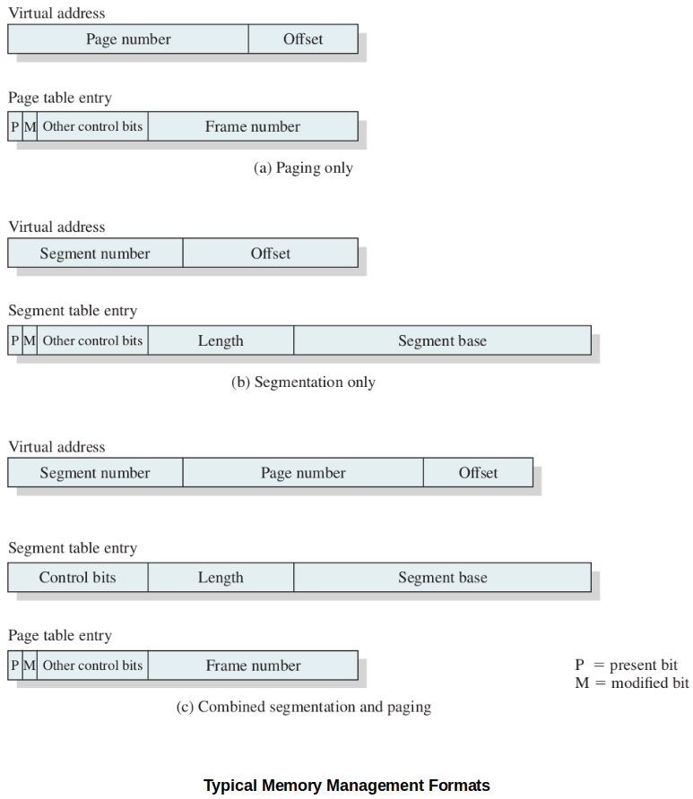
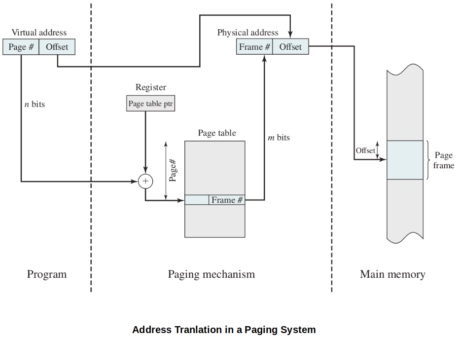
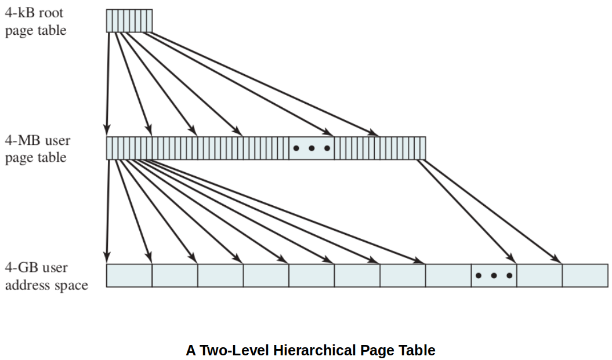
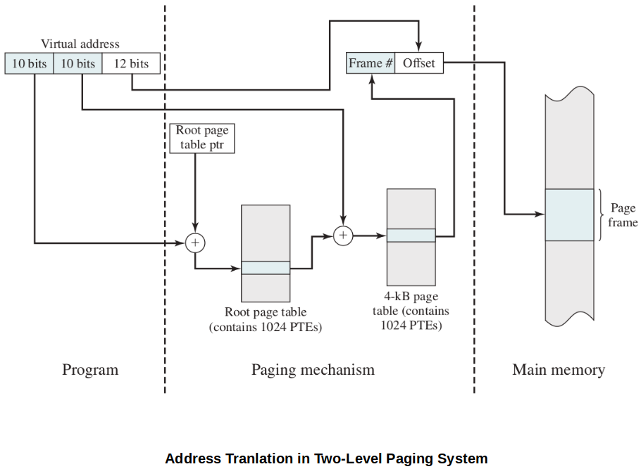
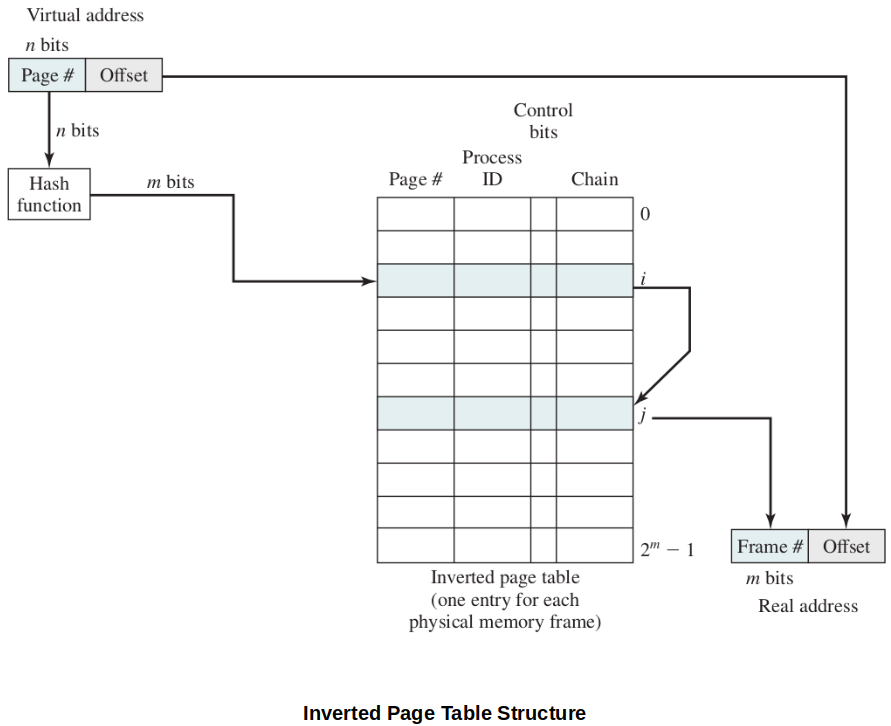
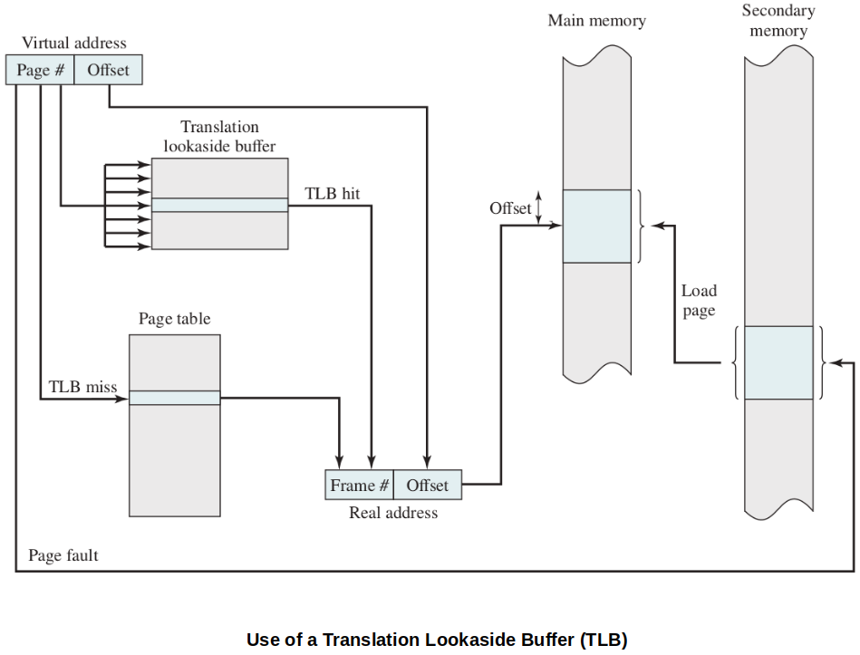
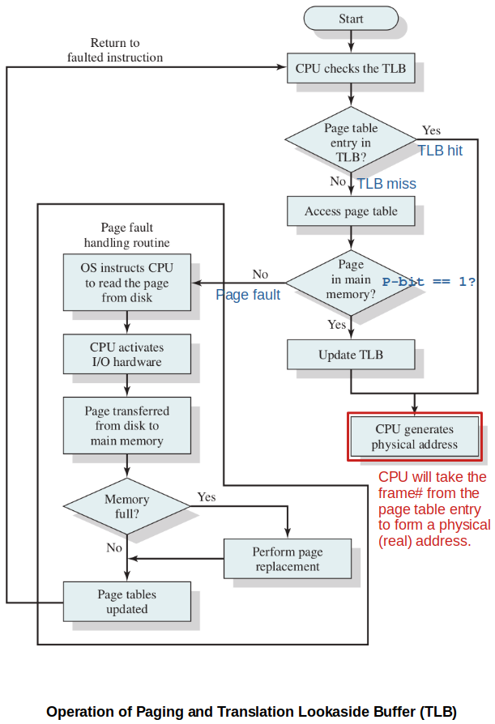

<a href="../">Notebook</a> > <a href="./">Operating Systems</a> > Hardware & Control Structures

# Hardware & Control Structures

## Introduction to Virtual Memory

* Two important characteristics of simple paging and simple segmentation:

  1. All memory refrences within a process are logical address that are dynamically translated into physical addresses at run-time. (A process may be swapped in and out of main memory such that it occupies different regions of main memory at different times during the course of execution.)
  2. A process may be broken up into a number of pieces (pages or segments) and these pieces need not be contiguously located in main memory during execution. The combination of dynamic run-time address translation and the use of a page or segment table permits this.

  These lead to the breakthrough in memory management; **it is not necessary that all of the pages or all of the segments of a process be in main memory during execution**.

* Mechanism of the new strategy

  Here, "piece" refers to a "page" or "segment" depending on which scheme is used.

  1. The OS begins by bringing in only one or a few pieces to include the initial program (code + data) piece .

     The portion of a process that is in main memory at a certain point in time is called the **resident set** of the process at that moment.

  2. Process executes smoothly as long as all memory references are to locations in the resident set.

     Page table or segment table is used during this process.

  3. If the processor encounters a logical address that is not in main memory, it generates an interrupt indicating a memory access fault (i.e., **page fault** or **segment fault**).

  4. The OS puts the interrupted process in a Blocking state.

  5. The OS issues a disk I/O read request to bring into main memory (i.e., **swap in**) the piece of the process that contains the missed logical address.

  6. The OS dispatches another process to run while the disk I/O is performed.

  7. Once the desired piece has been brought into main memory, an I/O interrupt is issued, giving control back to the OS, which places the affected process back into a Ready state.

* Two implications of this new strategy that lead to improved system utilization:

  * More processes may be maintained in main memory.
  * A process may be larger than all main memory.

* Because a process executes only in main memory, that memory is referred to as **real memory**. But a programmer or user perceives a potentially much larger memory (i.e., **virtual memory**) that is allocated on disk. 

### Locality and Virtual Memory

* In virtual memory management, **thrashing** (i.e., the system spending most of its time swapping process pages or segments rather than executing instructions) may occur.
* In this regard, the principle of locality suggests that a virtual memory scheme may be effective with the followings:
  * The hardware support for the paging and/or segmentation scheme to be employed
  * The OS must include software for managing the movement of pages and/or segments between secondary memory and main memory.
* This section examines the hardware aspect and looks at the **necessary control structures** which are created and maintained by the OS but are used by the memory management hardware.

## Virtual Memory Paging

* The major difference between the virtual memory paging and the simple paging we discussed earlier is that **not all pages need to be loaded** into main memory frames for execution.

* Due to this characteristics, page table entries now need to contain the following extra information:

  * P-bit (Present)

    Indicating whether the corresponding page is present (P) in main memory or not.

  * M-bit (Modified)

    Indicating whether the contents of the corresponding page have been modified since the page was last loaded into main memory. (It is unnecessary to write an unmodified page out when it needs to be replaced.)

  Other control bits may also be present. For example:

  * S-bit (Shared)
  * R-bit (Read only)
  * A-bit (Accessed recently)
  * ...

### Page Table Structure

* Hardware implementation of a page table.

  [!] Note: Typically, $n \gt m$, because the number of pages in a process may exceed the number of frames in main memory.

* Due to the potentially large size of a page table, virtual memory schemes store page tables in virtual memory rather than real memory so that only a subset is maintained in main memory at any time.
  * Page tables are subject to paging just as other pages are.
  * When a process is running, at least a part of its page table must be in main memory, including the page table entry of the currently executing page.
* Some processors make use of a two-level scheme page table to organize large page tables. (Typically, the maximum length of a page table is restricted to be equal to one page.)

### Inverted Page Table

* Above diagram shows a typical implementation of the inverted page table approach. For a physical memory size of $2^m$ frames, the inverted page table contains $2^m$ entries, so that the $i$th entry referes to frame $i$.
* Each entry includes the following:
  * Page number - page number portion of the virtual address
  * Process ID - the owner of this page (The combination of page number and process ID identifies a page within the virtual address space of a particular process.)
  * Control bits - includes flags (e.g., valid, referenced, and modified) and protection and locking information
  * Chain pointer - null if there are no chained entries for this entry, index value (i.e., [$0$, $2^m - 1$]) of the next entry in the chain otherwise.
* In this example, the hash function maps the $n$-bit page number into an $m$-bit quantity, which is used to index into the inverted page table.

### Translation Lookaside Buffer (TLB)

* TLB is a special high-speed cache for page table entries. (Contains the page table entries that have been most recently used)

* The following flowchart shows the use of TLB. To keep the flowchart simple, the fact that the OS may dispatch another process while disk I/O is underway is not shown.

  Given a virtual address, the processor will first examine the TLB.

  Also, notice that the TLB will always contain the information of the most recently referenced page.

## Segmentation

## Paging & Segmentation Combiend

## Protection & Sharing

## Virtual Memory Terminology

* **Virtual memory**

  A storage allocation scheme in which secondary memory can be addressed as though it were part of main memory. The addresses a program may use to reference memory are distinguished from the addresses the memory system uses to identify physical storage sites, and program-generated addresses are translated automatically to the corresponding machine addresses. The size of virtual storage is limited by the addressing scheme of the computer system, and by the amount of secondary memory available and not by the actual number of main storage locations.

* **Virtual address**

  The address assigned to a location in virtual memory to allow that location to be accessed as though it were part of main memory.

* **Virtual address space**

  The virtual storage assigned to a process.

* **Address space**

  The range of memory addresses available to a process.

* **Real address**

  The address of a storage location in main memory.

* **Resident set**

  A set of pages or segments of a process that is currently in main memory.

* **Page fault**

  When a referenced page is not resident in memory, an interrupt is generated to issue a request to read the page from secondary storage and loade it into an vailable frame in memory.

* **Thrashing**

  The state in which the system spends more of its processing time swapping process pages or segements into memory than executing useful process instructions.

* **Principle of locality**

  References to instructions and/or data addresses in a process tend to cluster togehter.

## References

Stallings, W. (2018). *Operating Systems: Internals and Design Principles* (9th ed.). Pearson Education, Inc.

