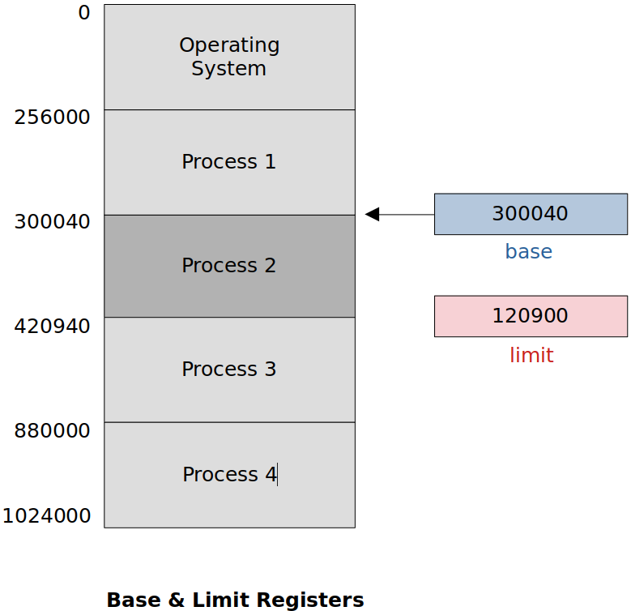

<a href="../">Notebook</a> > <a href="./">Operating Systesms</a> > [Main Memory] Introduction

# [Main Memory] Introduction


## Introduction to Main Memory

* The main purpose of a computer system is to execute programs.
* During execution, these programs, together with the data they access, must be in **main memory** (at least partially).

* CPU is shared by a set of processes with the help of CPU scheduling.
* CPU scheduling improves:
  * CPU utilization
  * Speed of the computer's response to its users
* To achieve this increase in CPU performance, however, several processes must be loaded on the main memory. That is, the processes must share the main memory. This is why effective **memory management** is called for.


## Main Memory - Basic Hardware

* Memory consists of **a large array of words or bytes**, each with its own address.

* Typical instruction execution cycle:

  1. Instruction fetch (from main memory)
  2. Decode
  3. Operand fetch (from main memory)
  4. Execute
  5. Operand store (to main memory)

* The CPU can directly access only:

  * Registers built into the processor
  * Main memory

  There are machine instructions that take memory addresses as arguments, but none that takes disk (secondary store) addresses. So, any instructions in execution, and any data being used by the instructions, must be in one of these direct-access storages.

  If the data required for the execution are not in main memory, they must be loaded into main memory before the CPU can operate on them.


## CPU Cycle Time for Memory Access

* **Registers (fast)** - Accessible within one clock cycle

  Most CPUs can decode instructions and perform simple operations on register contents at the rate of one or more operations per clock cycle.

* **Main memory (slow)** - Access may take many clock cycles

  In this case, the processor normally need to stall since it does not have the data required to complete the instruction that is being executed. CPU performance degrades seriously when memory access happens frequently. To resolve this issue, a fast memory buffer called the **cache** is introduced between the CPU and main memory.


## Protection of OS from Unauthorized Access

* The operating system has to be protected from access by the user processes. In addition, the user processes must be protected from one another. This protection must be provided by the hardware. But, how?

* Ensure that each process has a separate memory space.

  To do this, we need the ability to determine the range of legal addresses that the process may access and to ensure that the process can access only these legal addresses.

  To define a logical address space for each process, the following two registers are used:

  * **Base register** - Holds the lowest legal physical memory address
  * **Limit register** - Specifies the size of the range

* For example, in the following case, the Process 2 can legally access the addresses from 300040 to 420940 (inclusive) only.





* Legal memory access determination logic:

  ```c
  if (base < address && address <= base + limit)
      legal memory access
  else
      illegal memory access
  ```

* The base and limit registers can be loaded only by the OS, which uses a special privileged instruction. Since the privileged instructions can be executed only in kernel mode, and since only the OS executes in kernel mode, only the OS can load the base and the limit registers. This scheme allows the OS to change the value of these registers, but prevents the user processes from changing them.
* This is how the OS protects:
  * Itself from the unauthorized accesses
  * User processes from other processes' unauthorized accesses


## References

Joshy, J. (2018). *Operating System* [Video file]. Retrieved from  https://www.nesoacademy.org/cs/03-operating-system
