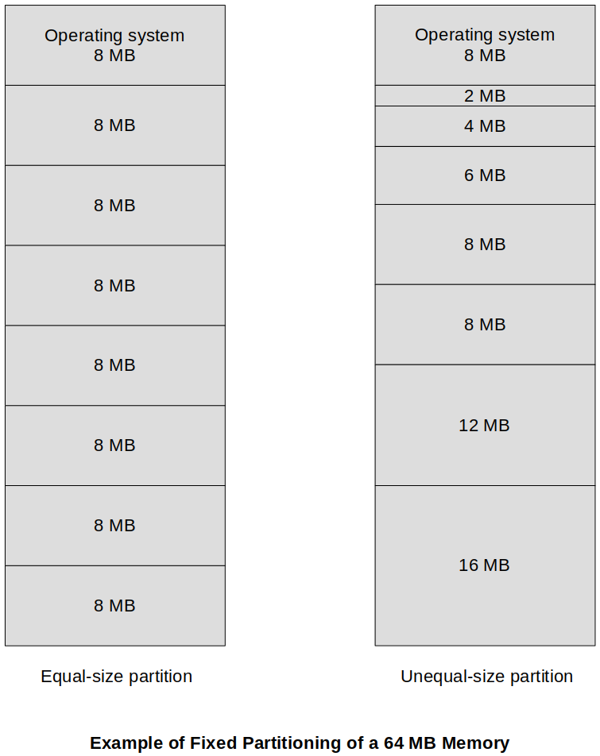

<a href="../">Notebook</a> > <a href="./">Operating Systems</a> > Memory Partitioning

# Memory Partitioning

## Introduction

* The principal operation of memory management is to bring processes into main memory for execution by the processor.

* In modern multiprogramming systems, this involves **virtual memory** which is based on the use of one or both of two basic techniques:
* Segmentation
  
  * Paging

* Before discussing the virtual memory (a sophisticated scheme), let's first look at the early version of memory management techniques; **partitioning**.

## Fixed Partitioning

* In a fixed partitioning, main memory is divided into
  * The OS occupying some fixed space
  * The rest partitioned into regions with fixed boundaries
    * Equal-size partitions
    * Unequal-size partitions

### Equal-Size Partitions

* Any process whose size is less than or equal to the partition size can be loaded into any available partition.
* If all partitions are full, and no process is in the Ready or Running state, the OS can swap a process out of any of the partitions and load in another process. (Some work for the processor!)
* Some disadvantages of using equal-size fixed partitions:
  * A program may be too big to fit in a partition
    * In this case, the programmer must design the program with the use of overlays.
  * Memory utilization is extremely inefficient.
    * Any program, regardless of size, occupies an entire partition
    * **Internal fragmentation** - Wasted space due to the block of data loaded being smaller than the partition.

### Unequal-Size Partitions

* Some disadvantages of using unequal-size fixed partitions:
  * The number of partitions specified at system generation time limits the number of active processes.
  * Small jobs will not utilize partition space efficiently.

## Dynamic Partitioning

## References

Stallings, W. (2018). *Operating Systems: Internals and Design Principles* (9th ed.). Pearson Education, Inc.
