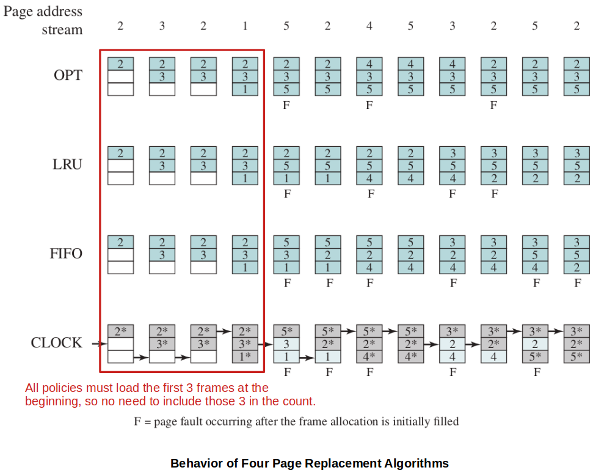
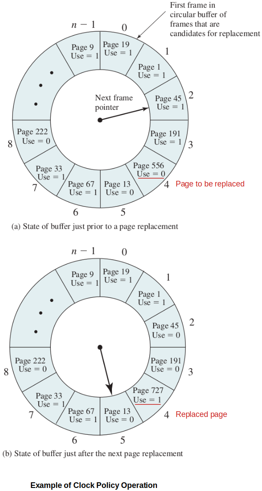

<a href="../">Notebook</a> > <a href="./">Operating Systems</a> > Operating System Policies for Virtual Memory

# Operating System Policies for Virtual Memory

## Operating System Policies for Virtual Memory Overview

* **Fetch policy**
  * Demand paging
  * Prepaging
* **Placement Policy**
* **Replacement Policy**
  * Basic algorithms:
    * Optimal, Least recently use (LRU), First-in-first-out (FIFO), Clock
  * Page buffering
* **Resident Set Management**
  * Resident set size
    * Fixed
    * Variable
  * Replacement scope
    * Global
    * Local
* **Cleaning Policy**
  * Demand
  * Precleaning
* **Load Control**
  * Degree of multiprogramming

## Fetch Policy

* Determines **when** a page should be brought into main memory.

### Demand Paging

* A page is brought in only when a reference is made to a location in that page.
* When a process first starts, there will be a flurry of page faults.
* Over time the page faults should dissipate.

### Prepaging

* Pages other than the one demanded are also brought in.
* Tries to minimize disk seeks by bringing in nearby pages, often very useful when a process starts up.
* Uses **principle of locality** to bring in nearby pages, but may be wasteful if those pages are never needed.

## Placement Policy

* Determines **where** in real memory a process piece is to reside.

* In a **pure segmentation system**, the placement policy is an important design inssue; policies such as best-fit, first-fit, and so on are possible alternatives. 
* However, for a system that uses either **pure paging** or **paging combined with segmentation**, placement is usually irrelevant because the address translation hardware and the main memory access hardware can perform their functions for any page-frame combination with equal efficiency.

## Replacement Policies

* When all of the frames in main memory are occupied and it is necessary to bring in a new page to satisfy a page fault, the replacement policy **determines which page currently in memory is to be replaced**.
* Most of the replacement policies try to predict future behavior based on past behavior. Because of the **principle of locality**, there is often a high correlation between recent refrencing history and near-future referencing patterns.
* Trade-off that must be considered - The more elaborate and sophisticated the replacement policy, the greater will be the hardware and software overhead to implement it.
* Frame locking - Some of the important frames in main memory may be locked.
  * Kernel of the OS, key control structures are held in locked frames.
  * I/O buffers and other time-critical areas may be locked into main memory frames.

### Basic Replacement Algorithms

#### Optimal

#### Least Recently Used (LRU)

#### First-In-First-Out (FIFO)

#### Clock

## References

Stallings, W. (2018). *Operating Systems: Internals and Design Principles* (9th ed.). Pearson Education, Inc.

