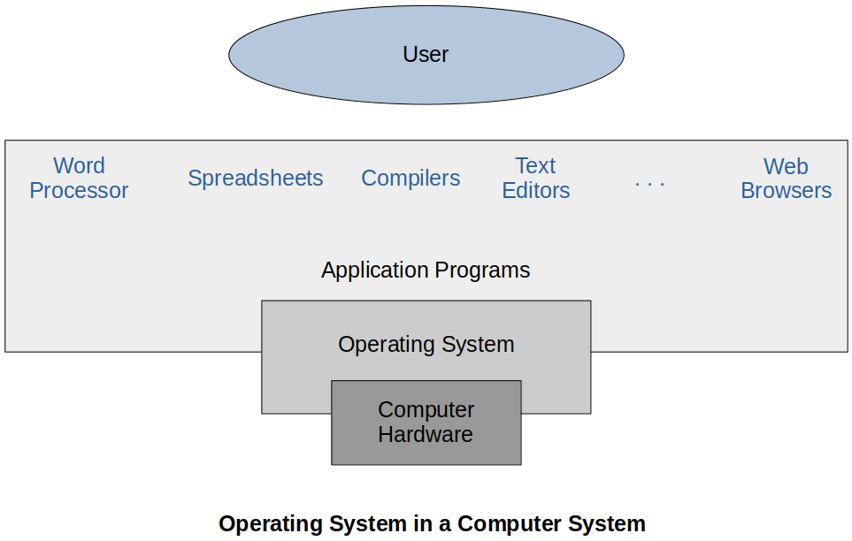
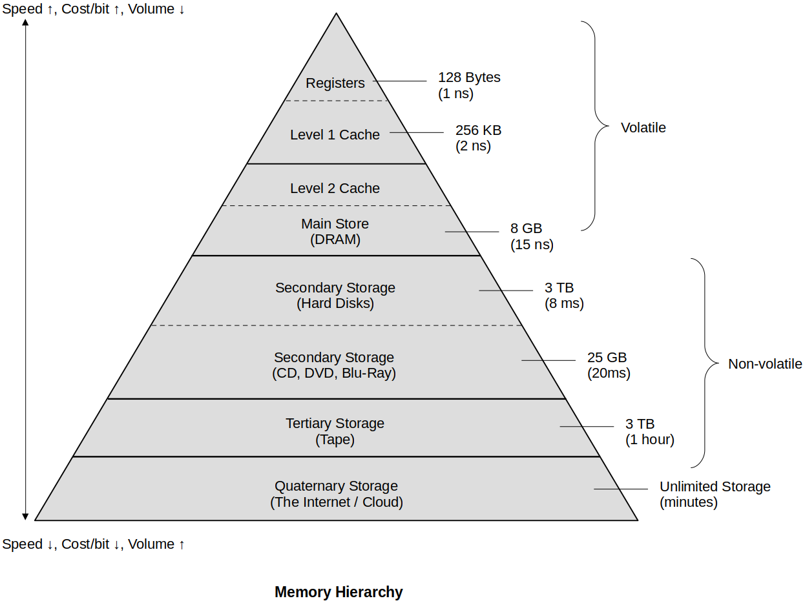

<a href="../">Notebook</a> > <a href="./">Operating Systems</a> > Operating Systems Overview

# Operating Systems Overview

## Introduction to Operating Systems

* An **operating system (OS)** is a program that manages the computer hardware. It also provides a basis for application programs and acts as an intermediary between the computer user and the computer hardware. (e.g., Windows, Unix, Linux, MacOs, etc.)

  The computer hardware refers to the resources like CPU, memory, I/O devices, etc.

  Application programs are programs or software that are used to perform a specific task and that can be directly used by the users.

* **Types of OS:**

  * Batch OS
  * Time sharing OS
  * Distributed OS
  * Network OS
  * Real Time OS
  * Multi-programming/processing/tasking OS

* **Goals of OS:**

  * Convenience - An OS makes a computer more convenient to use.
  * Efficiency - An OS allows the computer system resources to be used in an efficient manner.
  * Ability to evolve - An OS should be constructed in such a way as to permit the effective development, testing, and introduction of new system functions with out interfering with service.

* **Functions of OS:**

  * Interfacing between the user and the computer hardware
  * Resource management (e.g., memory management, file system management, process management, etc.)

## Basics of Operating Systems

### Computer System Operation

Some basic knowledge of the structure of computer system is required to understand how operating systems work.

* A modern general-purpose computer system consists of one or more CPUs and a number of device controllers (e.g., disk controller, USB controller, video adapter) connected through a common bus that provides access to shared memory.

  Each device controller is in charge of a specific type of device. The CPU and the device controllers can execute concurrently, competing for memory access. To ensure the orderly access to the shared memory, a memory controller whose functionality is to synchronize the accesses to the memory is provided.

* Some important terms:

  * Bootstrap program

    * The initial program that runs when a computer is powered up or rebooted.
    * It is stored in the ROM.
    * It must know how to load the OS and start executing that system.
    * It must locate and load into memory the OS kernel.

  * Interrupt

    * The occurrence of an event is usually signaled by an interrupt from hardware or software.

    * Hardware may trigger an interrupt at any time by sending a **signal** to the CPU, usually through the system bus.

    * When the CPU is interrupted, it stops what it is doing and immediately jumps to a designated location. The designated location usually contains the starting address where the service routine (i.e., interrupt handler) of the interrupt is located.

      The interrupt service routine is executed.

      Upon completion, the CPU resumes the interrupted computation.

  * System call (monitor call)

    * Software may trigger an interrupt by executing a special operation called the system call.

### Storage Structure

### I/O Structure

* Storage is just one of many types of I/O devices within a computer.

* A large portion of operating system code is dedicated to managing I/O, both because of its importance to the reliability and performance of a system and because of the varying nature of the devices.

* A general-purpose computer system consists of CPUs and multiple device controllers that are connected through a common bus. Each device controller is in charge of a specific type of device and maintains a **local buffer storage** and a set of **special purpose registers**.

  Typically, operating systems have a device driver for each device controller. This device driver understands the device controller and presents a uniform interface to the device to the rest of the operating system.

* I/O operation mechanism:

  1. To start an I/O operation, the device driver loads the appropriate registers within the device controller.

  2. The device controller, in turn, examines the contents of these registers to determine what action to take.
  3. The controller starts the transfer of data from the device to its local buffer.
  4. For every data transfer that is complete, the device controller informs the device driver through an interrupt (which involves the CPU) that it has finished its operation. The CPU is continuously interrupted by this operation.
  5. Once all the data transfer has been completed, the device driver returns control to the operating system.

  This form of interrupt-driven I/O is fine for moving small amounts of data but can produce high overhead when used for moving a bulk of data. To solve this problem, **Direct Memory Access (DMA)** is introduced.

  After setting up buffers, pointers, and counters for the I/O device, the device controller **transfers an entire data block directly to/from its own buffer storage from/to memory, without continuously interrupting the CPU**. This way, only one interrupt is generated per block, to tell the device driver that the operation has completed. While the device controller is performing these operations, the CPU is available for accomplishing other work.

### Computer System Architecture

Types of computer systems **based on the number of general purpose processors**:

* **Single Processor Systems**

  Contains only one processor which is capable of executing a general purpose instruction set including instructions from the user processes. Other special purpose processors are also present which perform device specific tasks.

* **Multiprocessor Systems (a.k.a. Parallel Systems or Tightly Coupled Systems)**

  Contains multiple processors in close communication and synchronization, sharing the computer bus and sometimes the clock, memory, and peripheral devices. Those processors may be carrying out the same task together or the different tasks independently.

  * Advantage

    * Increased throughput (performance), 
    * Economy of scale (since shared resources)
    * Increased reliability (even if one fails others can keep the system running)

  * Types of Multiprocessor Systems

    * Symmetric multiprocessing (SMP)

      All processors are **equal**. They can execute any type of processes as required.

    * Asymmetric multiprocessing (AMP, ASMP)

      The processors are inherently **unequal**. There may be a master slave  relationship where the master processor may assign processes to other  processors.

* **Clustered Systems**

  Like multiprocessor systesms, clustered systems gather together multiple CPUs to accomplish computation work. They are composed of two or more individual (complete) systems coupled together.

  * Advantage

    * High availability (even if one fails other can keep the system running)

  * Types of Clustered Systems

    * Symmetric

      One machine is in the hot-standby mode while others are running applications. If one system fails, the one in the hot-standby mode will take its place.

    * Asymmetric

      Two or more hosts run applications and they monitor each other.

## References

Joshy, J. (2021). *Operating System* [Video file]. Retrieved from https://www.nesoacademy.org/cs/03-operating-system
