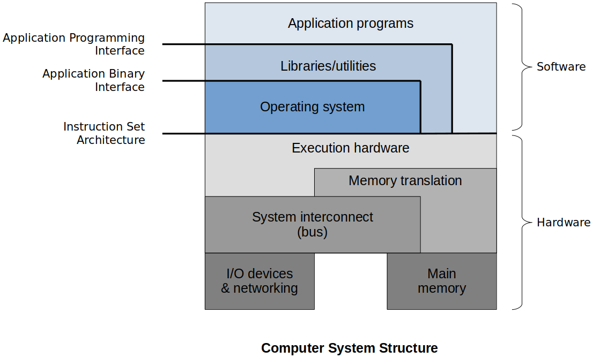
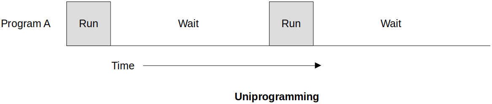
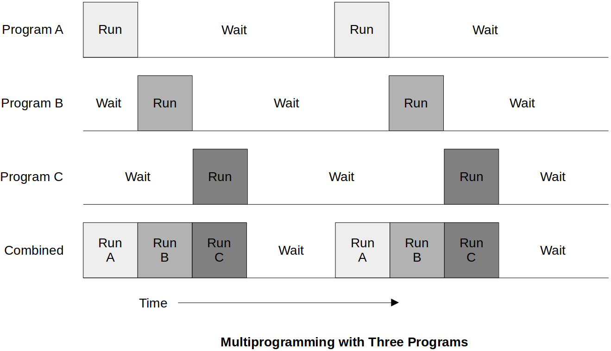

<a href="../">Notebook</a> > <a href="./">Operating Systems</a> > Operating Systems Overview

# Operating Systems Overview

## Purpose of an Operating System

The operating system controls the execution of application programs and acts as an interface between applications and the system hardware.

1. An OS makes a computer system more **convenient** to use.
2. An OS allows the computer's resources to be used **efficiently**.
   - When there many application running that need access to resources you want to make sure that they are used correctly and efficiently.
   - Efficiency is important in shared systems such as mainframes and super computers where multiple users or applications are sharing the system.
3. An OS should be constructed in order to permit the OS to **evolve** without interfering with current services.
   * We need to make sure that we are able to continually improve that operating system. It's important for the life-critical or system-critical software to not have to be stopped and rebooted in order to update/upgrade OS when you need to make changes to it.

### 1. Convenience

The OS typically provides services in the following areas:

* **Program development**

  Provide utilities that program developers can use to access the hardware and other portions of the computer via the OS

  e.g., Library functions we can use to interface with the system

* **Program execution**

  Load instructions, manipulate data, prepare resources

  e.g., We just run the program and all the work necessary to run a program such as loading, memory translation will be done by the OS.

* **Access to I/O devices**

  Because devices are specialized and differ, the OS provides a uniform interface for applications to use

  e.g., The way Unix/Linux made it easier is to treat everything as a *file*.

* **Controlled Access to Files**

  The OS not only manages the file system, but it can also control access through the security such as user management

* **System access**

  Similar to file access, the OS must control applications access to different parts of the system

* **Error detection and response**

  Internal/external hardware errors, forbidden memory references, etc.

* **Accounting**

  Not necessarily limited to *finance*

  Statistics gather that enables performance monitoring, usage information to be used to improve the system (OS has some data structures to keep this pieces of information in.)

* **Various APIs**

  API provides the standard binary system call interface, designed for portability of programs across machines using the same OS. Application programming interface is a high-level language standardization of the interfaces to OS facilities.
  
  e.g., I don't need to program directly using the Instruction Set Architecture. OS will translate my program written in a high-level language into the instructions that are supported by the hardware.

### 2. Resource Management / Efficiency

* The OS controls all of the system resources, including:

  * I/O devices

  * Files

  * Main and secondary memory

  * Processor execution time (CPU scheduling)

* The OS is itself software that needs to run on the CPU and use the same resources as the applications it manages.

* The OS frequently relinquishes control and must depend on the processor to allow it to regain control.

* The most critical portion of the OS resides in main memory (i.e., the **kernel**). The rest of the main memory is made available for applications to use.

### 3. Ease of Evolution

* Hardware upgrades and new types of hardware

* New services

* Fixes and patches

  For a user-grade system, the upgraded software has to be installed and the computer system has to be rebooted for that to take effect.

  For a specialized OS such as a life-support system on an international space station, OS must have the availability to upgrade itself without shutting down the system. (e.g., Live patch)

  General rule of thumb, less disruption to the system, the better.

* It is desirable to be able to update these features without shutting down the system, especially critical computing systems.  Therefore, today's operating systems are designed to allow updates and installations to a running system, when possible.

## Computer System Structure

* The OS sits right on top of the hardware and directly interacts with the underlying hardware.

* The OS generally supports a set of libraries and utilities that applications can use to communicate with the OS.

  e.g., The library call `fopen()` which invokes the system call `open()` inside it.

* Depending on the computer system structure there may or may not be other software layers other than OS that directly interact with the hardware.

* Main memory and external devices are connected via bus.

* Execution hardware includes ALU, Control Unit, etc.

## History of OS Design

How have operating systems evolved over the years?

### 1. Serial Processing (1950s)

* No operating system - Programmers (or operators) interacted directly with the computer hardware feeding them serious of punch cards.
* Computers ran from a console with display lights, toggle switches, some form of input device, and a printer.
* Users have access to the computer in "series".
* Scheduling - Most installations used a hard copy sign-up sheet to reserve computer time.
  * Time allocations could run short or long, resulting in wasted computer time.
  * A considerable amount of time was spent just on setting up the program to run.
  * Computer sat idle when it didn't have to.
* Long story short, very very inefficient!

### 2. Simple Batch & Job Monitor

* Early computers were very expensive.
  * Important to maximize processor utilization
  
* Monitor
  * User no longer has direct access to processor
  
  * Job is submitted to computer operator who batches them together and places them on an input device, the **monitor** which loads the program and lets it run
  
    Program A runs, monitor reads program B (Only one program running at a time)
  
  * Program branches back to the monitor when finished
  
* Job monitor software lead to the creation of memory protection, privileged instructions and interrupts which, in turn,  helped create improvements in utilization in the next type of OS.

* Monitor controls the sequence of events

* Resident Monitor is software always in memory

* Monitor reads in job and gives control

* Job returns control to monitor

* Processor time alternates between execution of user programs and execution of the monitor

* Sacrifices:
  * Some main memory is now given over to the monitor
  * Some processor time is consumed by the monitor
  
* Despite overhead, the simple batch system improves utilization of the computer.

* **Uniprogramming**
  * Only one program is running from beginning to completion (While the program is performing an I/O operation, the processor just sits there idle wasting time)
  * I/O is slow compared to CPU-involved instructions (arithmetic)
  * The processor spends a certain amount of time executing, until it reaches an I/O instruction; it must then wait until that I/O instruction concludes before proceeding.

### 3. Multiprogramming

* Multiprogramming is discussed in the single-processor system. (Multiprocessing  $\to$ Multi-processor system)
* Multiprogramming is the method of allowing more than one program to be interleaving their execution.
* The development of multiprogramming in batch systems GREATLY increased resource utilization.
* Multiprogramming allows another program to execute while the first is waiting for an I/O other device request to complete. This improved the throughput of the system.
* When the I/O task is complete, an interrupt is sent to the CPU. The monitor can then interpret the interrupt and return the first program to execution status.
* Original multiprogramming systems required all of the executing programs to reside in memory. Small memory limited the number of running programs.
* Multiprogramming is a common feature of modern operating systems.
* Also called as concurrency. (Multiple threads taking turns to execute on a CPU.)

### 4. Time Sharing Systems

Because batch systems were designed to handle the execution of mainly non-interactive systems, they are not suitable for user-oriented systems.

* Time-sharing systems were developed to enable quick user response time at the sacrifice of compute time.
* This enables many people to share the system and perceive it as dedicated to themselves. It required the ability to load more applications into memory at the same time.
* Academic institutions used these systems to provide programming courses. Students used terminals to interact with the operating systems and write and test programs (BASIC).

## Modern OS Features

Critical areas of development that support modern operating systems.

1. Process

2. Memory management

3. Information protection & security

4. Scheduling and resource management
5. Fault tolerance

### 1. Process

* The concept of a process is central to the design of operating systems.
* A process is a **program in execution**.
* A process contains three components:
  * An executable program
  * The associated data needed by the program (variables, work space (e.g., stack), buffers, etc.)
  * The execution context (or "process state") of the program - this is essential
    * Part of a data structure that operating system keeps about every process
    * It is the internal data by which the OS is able to supervise and control the process.
    * Includes the contents of the various process registers
    * Includes information such as the priority of the process and whether the process is waiting for the completion of a particular I/O event.

### 2. Memory Management

* The OS has 5 principal storage management responsibilities:
  * Process isolation
  * Automatic allocation and management
  * Support of modular programming
  * Protection and access control
  * Long-term storage

### 3. Information Protection & Security

* The nature of the thread that concerns an organization will vary greatly depending on the circumstances.
* The problem involves controlling access to computer systems and the information stored in them.

### 4. Scheduling and Resource Management

* The KEY responsibility of an OS is managing resources.
* Resource allocation policies must consider:
  * Efficiency
  * Fairness - No starvation!
  * Responsiveness

### 5. Fault Tolerance

* Another feature of modern systems

* Fault tolerance can be supplied both by:

  * Hardware (e.g., redundant disk arrays)
  * Software (e.g., verification, sanity checks)

* The more reliable a system is, the more costly.

* The extent to which adoption of fault tolerant measures is determined by how critical the system or resource is.

  | Class               | Availability | Annual Downtime |
  | ------------------- | ------------ | --------------- |
  | Continuous          | 1.0          | 0               |
  | Fault Tolerant      | 0.99999      | 5 mins          |
  | Fault Resilient     | 0.9999       | 53 mins         |
  | High Availability   | 0.999        | 8.3 hrs         |
  | Normal Availability | 0.99 - 0.995 | 44 - 87 hrs     |

  Continuous system - Very expensive. If one component fails, another in the system must be able to take over its place in such a way that the system goes on as if nothing has every happened.
  
  Fault resilient system - e.g., Weapon monitoring system, etc.
  
  High availability system - e.g., Time sheet program, airline reservation system, etc. It can be down for a short period of time  here and there for system updates, issue resolution, etc.

## References

Allen, B. (2023, January 10). Introduction to Operating Systems [Lecture]. University of Alabama in Huntsville, Huntsville, AL, United States.
