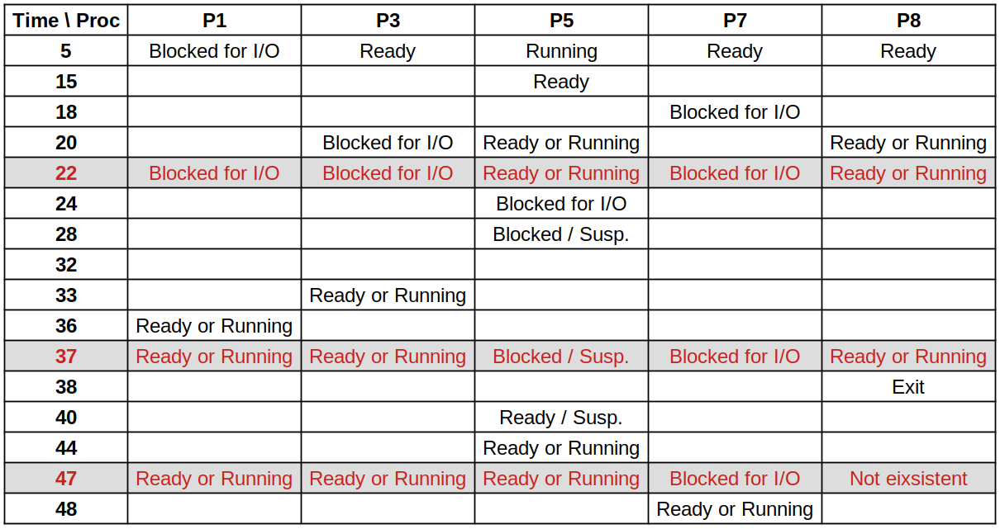
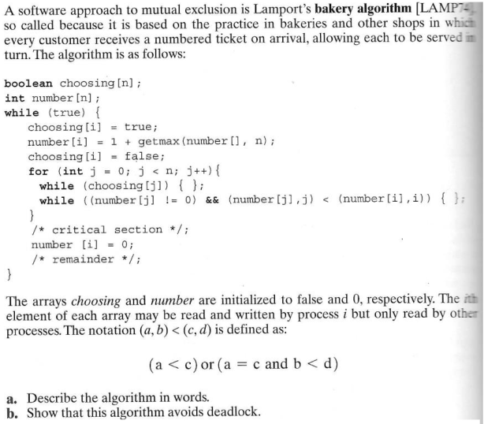
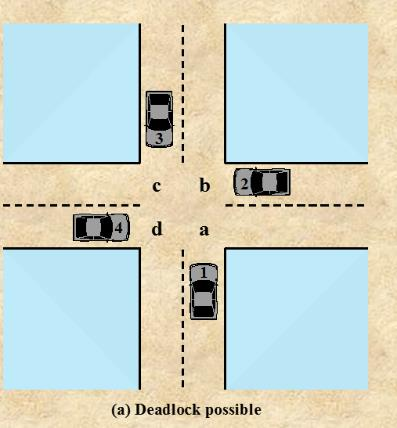
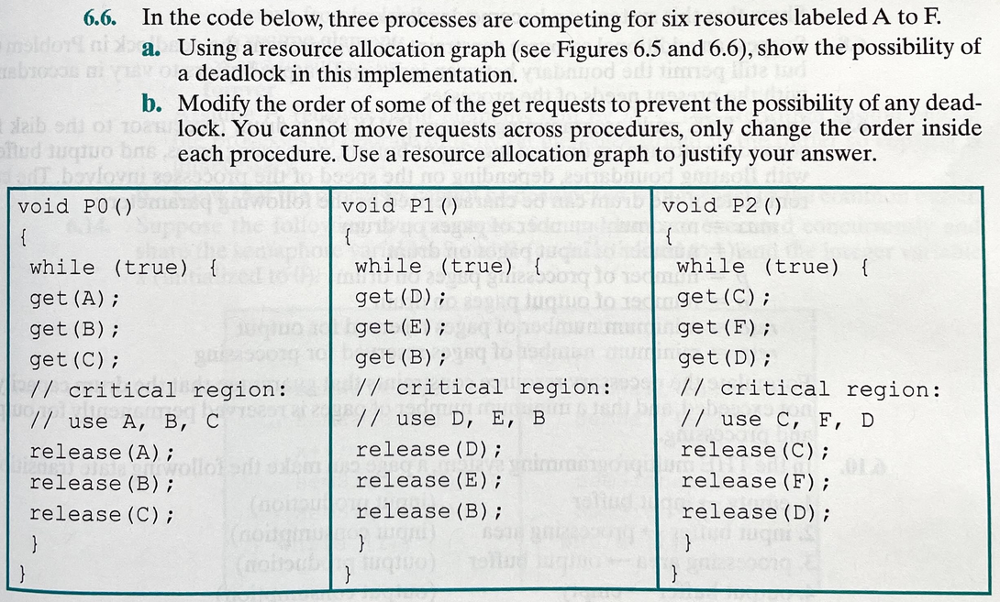

<a href="../">Notebook</a> > <a href="./">Operating Systems</a> > Review Questions

# Review Questions


## Computer System Overview

* **What is an interrupt? How do operating systems detect them?**

  An interrupt is a mechanism by which other modules (I/O, memory) may interrupt the normal sequencing of the processor. The process checks for an interrupt flag at the end of each fetch-execute cycle to determine if something needs to be dealt with.

* **What are the benefits of organizing memory in a hierarchy?**

  Cache memory is a memory that is smaller and faster than main memory and that is interposed between the processor and main memory. The cache acts as a buffer for recently used memory locations. There can be multiple caches, the faster and closer to the CPU the more costly it is. Having a hierarchy of memory allows the hardware to assist in speeding up memory accesses without the CPU having to intervene as much, as well as spread out the cost.

* **What is the difference between a multiprocessor and a multicore system?**

  A multicore computer is a special case of a multiprocessor, in which all of the processors are on a single chip.

* **What does it mean to say that a process/program is I/O bound?**

  The process spends a much greater fraction of its time waiting for I/O instead of computing instructions on the CPU/ALU.

* **What does it mean to say that a process/program is CPU bound?**

  The process spends a much greater fraction of its time computing instructions than waiting for I/O.

* **Consider the following code segment, and give one example of spatial locality in the code:**

  ```c
  for (i = 0; i < 20; i++)
  	for (j = 0; j < 10; j++)
          arr[i] = arr[i] * j;
  ```

  Spatial locality refers to the tendency of execution to involve a number of memory locations that are clustered. In the above code, while looping the outerloop, the accesses to elements in array `arr` are physically close to each other in memory. This is a characteristic of contiguously stored data structures such as arrays.


## Operating System Overview

* **What is multiprogramming?**

  Multiprogramming is the method of allowing more than one program to be interleaving their execution on a single processor.

* **What is multiprocessing?**

  Multiprocessing is the method of allowing the physical computation of processes in parallel, on different processors or computing hardware.

* **Explain the difference between a monolithic kernel and a microkernel design.**

  The kernel is a portion of the operating system that includes the most heavily used portions of software. Generally, the kernel is maintained permanently in main memory.

  Microkernel implements the most important core features in the memory resident portion of the operating system whereas Monolithic kernels include all possible OS features in the core. Microkernels use memory more efficiently by allowing some operating system features to be managed as if they were normal processes and can be swapped in/out of memory. This makes it easier to change/add-to/update an operating system.


## The Process

* **What does it mean to preempt a process?**

  Process preemption occurs when an executing process is interrupted by the processor so that another process can be executed.

* **What is swapping and what is its purpose?**

  Swapping is moving the memory contents of a process into/out of secondary storage to free up/restore memory for the process. Freeing up allows the OS to admit/execute other processes that need memory resources.

* **What is the difference between a mode switch and a process switch?**

  A mode switch may occur without changing the state of the process that is currently in the running state.

  A process switch involves taking the currently executing process out of the running state in favor of another process. The process switch involves saving more state information.

* **Assume that at time 5, no system resources are being used except for the processor and memory. Now consider the following events:**

  At time 5: P1 executes a command to read from disk unit 3
  At time 15: P5’s time slice expires
  At time 18: P7 executes a command to write to disk unit 3
  At time 20: P3 executes a command to read from disk unit 2
  At time 24: P5 executes a command to write to disk unit 3
  At time 28: P5 is swapped out
  At time 33: An interrupt occurs from disk unit 2; P3’s read is complete
  At time 36: An interrupt occurs from disk unit 3; P1’s read is complete
  At time 38: P8 terminates
  At time 40: An interrupt occurs from disk unit 3; P5’s write is complete
  At time 44: P5 is swapped back in
  At time 48: An interrupt occurs from disk unit 3; P7’s write is complete

  **For each time 22, 37 and 47, identify which state each process is in. If a process is blocked, indicate why it is blocked. (Use 7-State Model)**

  See the red-marked rows in the table below.

  




* **Consider the 7-state transition diagram. Suppose it is time for the OS to dispatch a process and there are processes in both the Ready State and the Ready/Suspend state. At least one process in the Ready/Suspend state has higher priority than any of the Ready processes. Two extreme policies are as follows:**

  * **always dispatch from a process in the Ready State to minimize swapping**
  * **always give prefrence to the highest priority process even though that may mean swapping**

  **Suggest an intermediate policy that tries to balance the concerns of priority and performance.**

  One way is to penalize the Ready/Suspended process by some fixed amount, such as one or two priority levels, so that a Ready/Suspended process is chosen next only if it has a higher priority than the highest-priority Ready process by several levels of priority.

* **Consider the 7-state transition diagram. It is theoretically possible to have a transition between any two states. For example, the transition from READY to RUNNING is the dispatch action. What are the impossible transitions between states, and explain each.**

  1. **Exit $\to$ Any State**: Can't turn back the clock.
  2. **Any State $\to$ New**: Can't turn back the clock.
  3. **New $\to$ Blocked, Blocked/Suspended, or Running**: A newly created process remains in the new state until the processor is ready to take on an additional process, at which time it goes to one of the Ready states.
  4. **Ready/Suspended $\to$ Running**: The OS first brings the process into memory (i.e., swap-in), which puts it into the Ready state before it can transition to Running state.
  5. **Ready/Suspended $\to$ Blocked, or Blocked/Suspended**: Typically, a process that is in Ready/Suspended state cannot subsequently be blocked until it has run. Some systems may allow the OS to block a process that is currently ready, perhaps to free up resources committed to the ready process.
  6. **Ready $\to$ Blocked, or Blocked/Suspended**: Typically, a process that is in Ready state cannot subsequently be blocked until it has run. Some systems may allow the OS to block a process that is currently ready, perhaps to free up resources committed to the ready process.
  7. **Running $\to$ Blocked/Suspended**: This transition would be done in 2 stages.
  8. **Blocked $\to$ Running**: When a process is unblocked, it is put into the Ready state. The dispatcher will only choose a process from the Ready state to run. This process would be done in 2 stages.
  9. **Blocked $\to$ Ready/Suspended**: A blocked process cannot at the same time be made ready and suspended, because these transitions are triggered by two different causes. This transition would be done in 2 stages.
  10. **Blocked/Suspended $\to$ Ready**: Same reasoning as Blocked $\to$ Ready/Suspended
  11. **Blocked/Suspended $\to$ Running**: Same reasoning as Blocked $\to$ Running

  [!] Note: **Any State $\to$ Exit** is possible under forced termination of a program?


## Threads

* **Define jacketing.**

  Jacketing converts a blocking system call into a non-blocking system call by using an application level I/O routine to check the state of the I/O device. This enables a language to support threads that need to wait on I/O without blocking the entire process that contains th threads from doing any other useful work.

* **In discussion of ULTs vs. KLTs, it was pointed out that a disadvantage of ULTs is that when a ULT executes a system call, not only is that thread blocked, but also allof the threads within the process are blocked. Why is that so?**

  This is because ULTs are usually implemented by the programming language within a single process and, therefore, the threaded structure of the process that contains the threads is not visible to the OS at all. The OS cannot manage those threads separately from the process. So, from the OS point of view, the process is issuing a blocking call, not a thread.

* **If a process exits (moves to exit state) and there are still threads of that process that have not completed running, will they continue execute?**

  When a process exits, ALL of its resources must be reclaimed. This means that all of the memory allocated to that process, any devices it uses and the CPU cannot be given to it. Therefore, its threads can no longer have any state associated with them.

  Do not confuse this with fine-grained process oriented operating systems that allow processes to spawn many children instead of threads. Child processes can exist apart from their parent processes much of time.

* **Explain the rationale for the uninterruptable state in Linux.**

  The Uninterruptable state is another blocked state. The difference between this and the Interruptable state is that in an uninterruptable state, a process is waiting directly on hardware conditions and therefore will not handle any signals. This is used in situations where the process must wait without interruption or when the event is expected to occur quite quickly. For example, this state may be used when a process opens a device file and the corresponding device driver starts probing for a corresponding hardware device. The device driver must not be interrupted until the probing is complete, or the hardware device could be left in an unpredictable state.


## Concurrency

* **Practice tracing Dekker's algorithm and Peterson's algorithm for software enforced mutual exclusion.**

  Practice on your own!

* **Show a sequence of execution such that "X is 10" is printed for the following two processes (P1 and P2). Note that the scheduler in a uniprocessor system would implement pseudo-parallel execution of these processes by interleaving their instructions, without arbitrary restrictions or timing.**

  ```plain
  p1: begin
  	shared int x;
  	x = 10;
  	while (true) do
          x = x – 1;
          x = x + 1;
          if (x != 10) then
              print “x is %d”, x
          end if
  	end while
  end P1
  ```

  ```plain
  P2: begin
      shared int x;
      x = 10;
      while (true) do
          x = x – 1;
          x = x + 1;
          if (x != 10) then
          	print “x is %d”, x
          end if
      end while
  end P2
  ```

* **Is busy waiting always less efficient (in terms of using processor time) than a blocking wait? Explain.**

* **Lamport's Algorithm**





* **Work the textbook problem 5.28 on page 260 (9th edition).**
* **Work the textbook problem 5.19 on page 256 (9th edition).**


## Deadlock

* **Show that the four conditions of deadlock apply to the figure below:**

  




* **Given the following state for the Banker's Algorithm:**

  * **6 processes P0 through P5**

  * **4 resource types: A (15 instances), B(6), C(9), D(10)**

  * **Snapshot at time T0: Available $V = (6, 3, 5, 4)$**
  
  * **Allocation** - $A_{ij}$ = current allocation to process $i$ of resource $j$
    $$
    A =
    \begin{pmatrix}
    2 & 0 & 2 & 1 \\
    0 & 1 & 1 & 1 \\
    4 & 1 & 0 & 2 \\
    1 & 0 & 0 & 1 \\
    1 & 1 & 0 & 0 \\
    1 & 0 & 1 & 1 \\
    \end{pmatrix}
    $$
    
  * **Claim** - $C_{ij}$ = maximum requirement of process $i$ for resource $j$
    $$
    C =
    \begin{pmatrix}
    9 & 5 & 5 & 5 \\
    2 & 2 & 3 & 3 \\
    7 & 5 & 4 & 4 \\
    3 & 3 & 3 & 2 \\
    5 & 2 & 2 & 1 \\
    4 & 4 & 4 & 4 \\
    \end{pmatrix}
    $$
    

​		**a) Verify that the Available vector has been correctly calculated.**

​		**b) Calculate the Need matrix ($C-A$)**

​		**c) Show that the current state is safe, that is, show a safe sequence of processes. In addition, to the sequence show how the Available (working vector) changes as each process terminates.**

​		**d) Given the request (3, 2, 3, 3) from Process P5. Should this request be granted? Why or why not?**


* **Problem 6.6 (9th edition)**





* **Consider a system consisting of 4 processes and a single resource type. The current state of the claim and allocation matrices are below. What is the minimum number of units of the resource needed to be available for this state to be safe?**
  $$
  \text{Claimed} =
  \begin{pmatrix}
  3 \\
  2 \\
  9 \\
  7 \\
  \end{pmatrix}
  $$

  $$
  \text{Allocated} =
  \begin{pmatrix}
  1 \\
  1 \\
  3 \\
  2 \\
  \end{pmatrix}
  $$

  

  


## References

Stallings, W. (2018). *Operating Systems: Internals and Design Principles* (9th ed.). Pearson Education, Inc.
