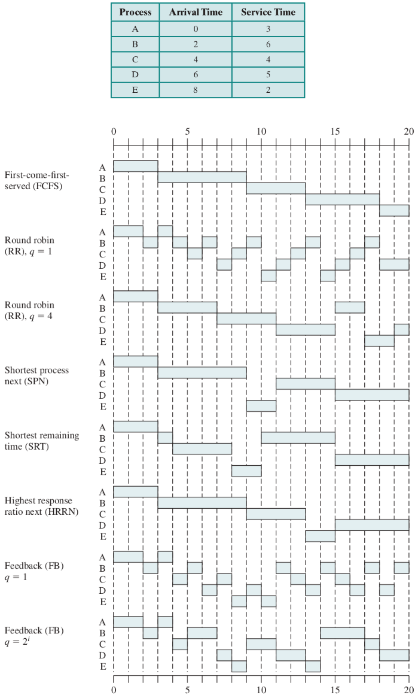
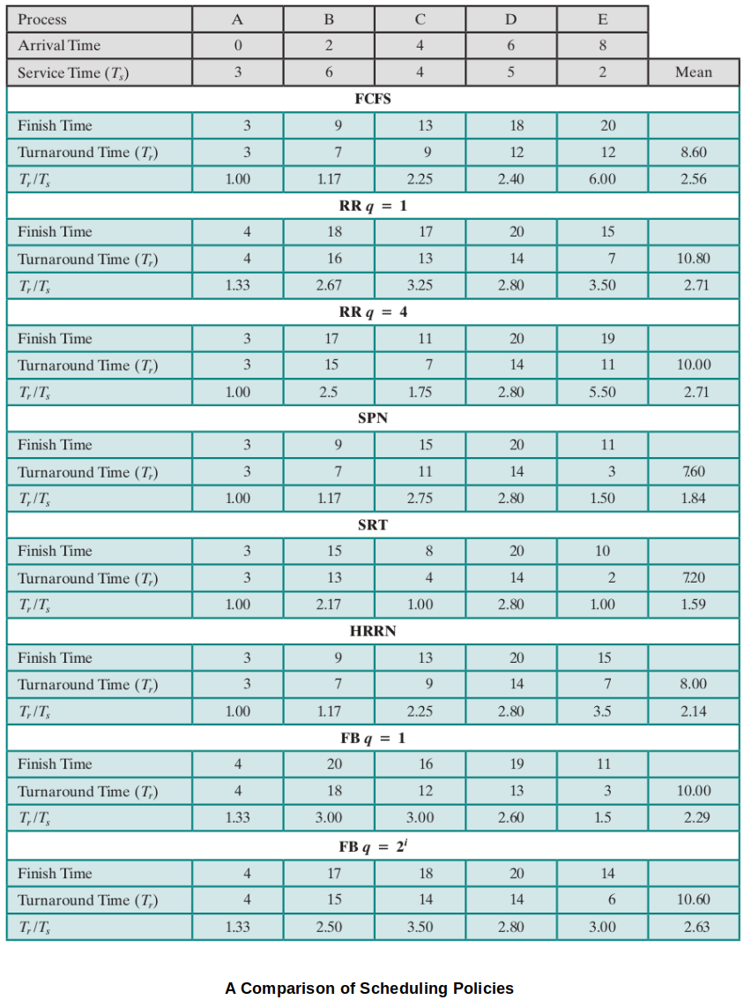

<a href="../">Notebook</a> > <a href="./">Operating Systems</a> > Scheduling Algorithms

# Scheduling Algorithms

## Short-Term Scheduling Criteria

* The main objective of short-term scheduling is to allocate processor time to optimize certain aspects of system behavior. 
* When examining or proposing scheduling policies, we need metrics that can be computed for evaluation.

* A commonly used criteria can be categorized along two dimensions.
  * **User-oriented criteria**
    * Relate to the behavior of the system as perceived by the individual process (e.g., **response time** in an interactive system)
    * Can be difficult to measure
  * **System-oriented criteria**
    * Focus is on effective and efficient utilization of the processor (rate at which processes are completed).

### Quantitative Measurements Related to System Criteria

* **Throughput**

  * The scheduling policy should attempt to maximize the number of processes completed per unit time:
    $$
    \text{Throughput} = \frac{\text{\# processes completing}}{\Delta t}
    $$

  * A measure of how much work is being performed.

  * Clearly depends on the average length of a process, but is also influenced by the scheduling policy, which may affect utilization.

* **Turnaround time (TAT)** 

  * Time interval between the "admit" of a process and its "exit". 

  * The amount of time a process spends in the system: 
    $$
    \text{TAT $=$ Finish time $-$ Arrival time $=$ Execution time $+$ Waiting time}
    $$

  * Appropriate measure for a batch job.

* **Normalized Turnaround time (nTAT)** 

  * The turnaround time normalized to process size:
    $$
    \text{nTAT} = \frac{\text{TAT}}{\text{Service time}}
    $$
    Where "service time" is the computation time of the process. (i.e., The amount of execution time the process needs on the CPU.)

* **Wait time**

  * Cumulative time that a process is in the system (i.e., admited) but not using the CPU.

### Other Factors

* In addition to the quantitative measures, we can also consider other factors that affect the behavior of processes under various policies:
  * Overhead - Does a particular policy incur more overhead to implement?
  * Effect on processes - Are certain types of processes favored / penalized unfairly by policy choices?
  * Fairness, starvation, etc.

## Process Scheduling Policies

* Scheduling policies may be **preemptive** or **non-preemptive**:
  * Preemptive
    * Currently running process may be interrupted and moved to ready state by the OS.
    * Decision to preempt may be performed when a new process arrives, when an interrupt occurs that places a blocked process in the Ready state, or periodically, based on a clock interrupt.
  * Non-preemptive
    * Once a process is in the running state, it will continue until it terminates or blocks itself for I/O.
* Scheduling policies:
  * Priority-based (Pure)
  * First Come First Served (FCFS)
  * Round Robin (RR)
  * Virtual Round Robin (vRR)
  * Shortest Process Next (SPN)
  * Shortest Remaining Time Next (SRT)
  * Highest Response Ratio Next (HRRN)
  * Multi-Level Feedback

### Priority-Based (Pure)

* Very simple
* Preemptive - Removes lower priority process from the CPU.
* Naturally favors higher-priority processes over lower priority, so low priority process starves.
* Only considers the priority of processes when determining the next to run.
* May use adaptation techniques to temporarily increase or decrease some processes priority to prevent starvation (no longer *pure priority*).

### First Come First Served (FCFS)

## References

Stallings, W. (2018). *Operating Systems: Internals and Design Principles* (9th ed.). Pearson Education, Inc.

