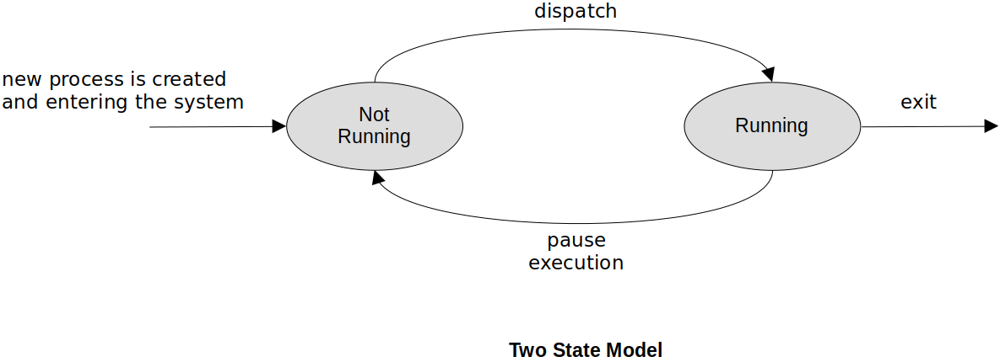
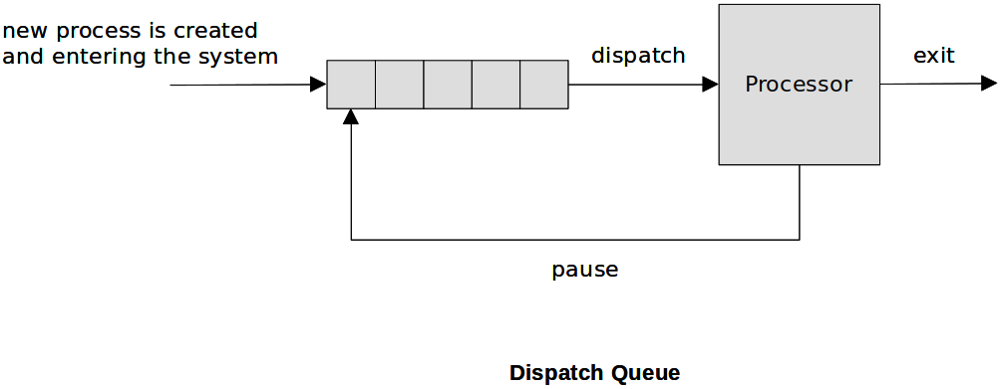
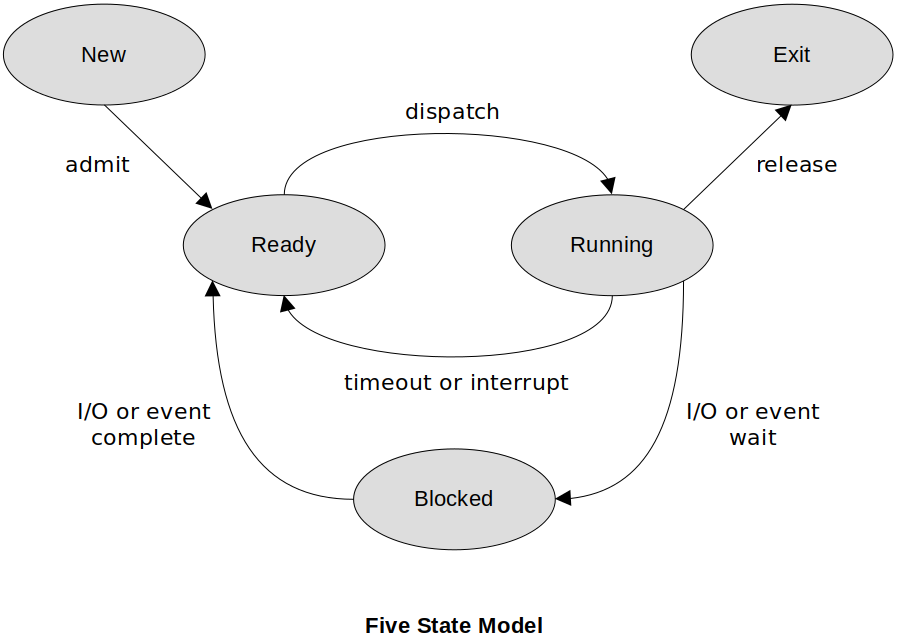
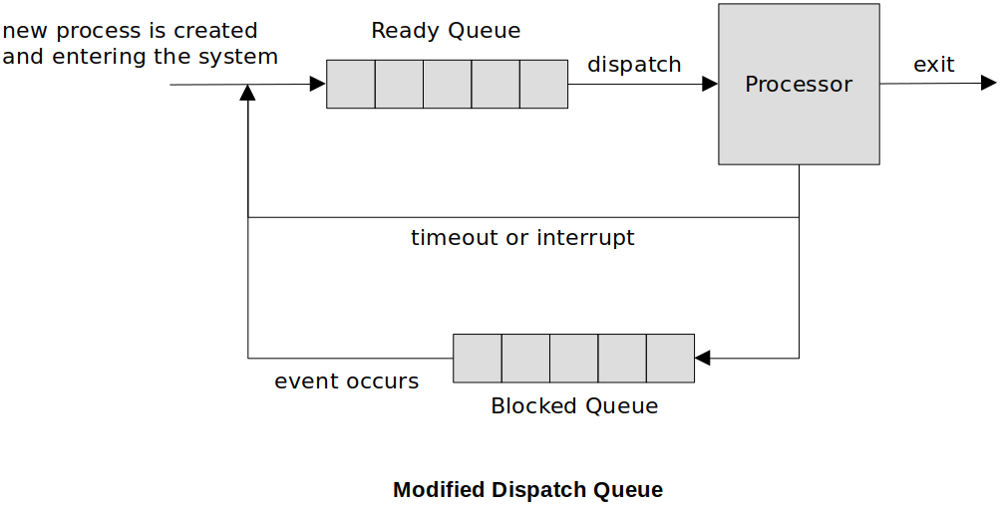
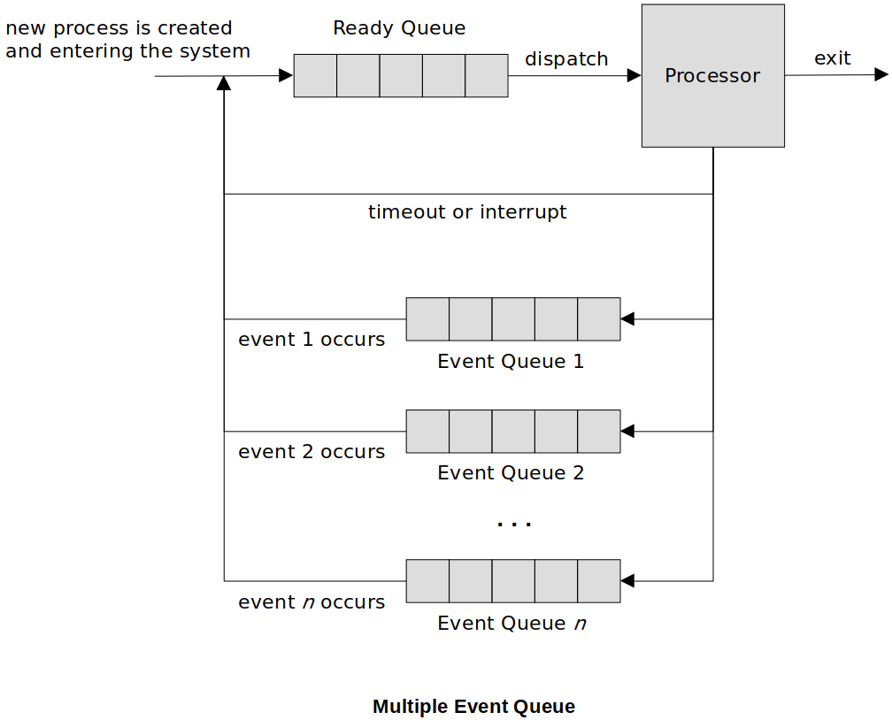

<a href="../">Notebook</a> > <a href="./">Operating Systems</a> > The Process - Process State Models & Control

# The Process - Process State Models & Control

## Process States & Context Switch

* When the operating system removes one process from running on the CPU and allows a different process to gain control of the CPU, this is called **context switch**.
* The system status of the current process (a.k.a. the context) is saved into its PCB and the system status of the new process is retrieved from its PCB in order to restore the system where it left off.
* The portion of the OS that performs the context switch is called the **dispatcher**. This procedure is referred to as **dispatching**.

## Two State Model

* A process is either **running** or **not running**.

* The two-state model is too simplistic for a realistic operating system.
  * Processes are in the dispatch queue (non-running) that may not actually be ready to run. Why?
  * No way to differentiate between the non-running processes.
* On a uniprocessor system, there can be only ONE process in the running state. On a multiprocessor system, there can be MULTIPLE processes in the running state at the same time

### Dispatch Queue

* In order to maintain the list of processes that are not running, but waiting for their turn on the processor, we use what is called the dispatch queue.
* The queue maintains pointers to the PCBs of the waiting processes

### Process Creation

* Common events that cause process creation in the system:
  * New batch job - OS reads bath job control to load a new program
  * Interactive login - a process is created for the user
  * Start a service - the OS creates a process to provide services to other processes (ex: print)
  * Spawned by existing process

### Process Termination

* The program that a process is running is ready to end:
  * Normal exit/return
  * User logs off an interactive session or quits a running program
  * A parent process terminates, causing its child processes to end
  * Fatal error
  * Kill process request (when a process must be forced to end)

## Five State Model

* **Running** - the process that is currently being executed on the processor
* **Ready** - a process is ready to execute (not waiting on pending events)
* **Blocked** (a.k.a. **Waiting**) - the process cannot resume execution until some event occurs
* **New** - a process is just created, but not yet loaded into memory
* **Exit** - a process has completed and its PCB storage can be reclaimed

### How Does this Modify the Dispatch Queue?

### Multiple Event Queues

## References

Allen, B. (2023, January 10). Introduction to Operating Systems [Lecture]. University of Alabama in Huntsville, Huntsville, AL, United States.
