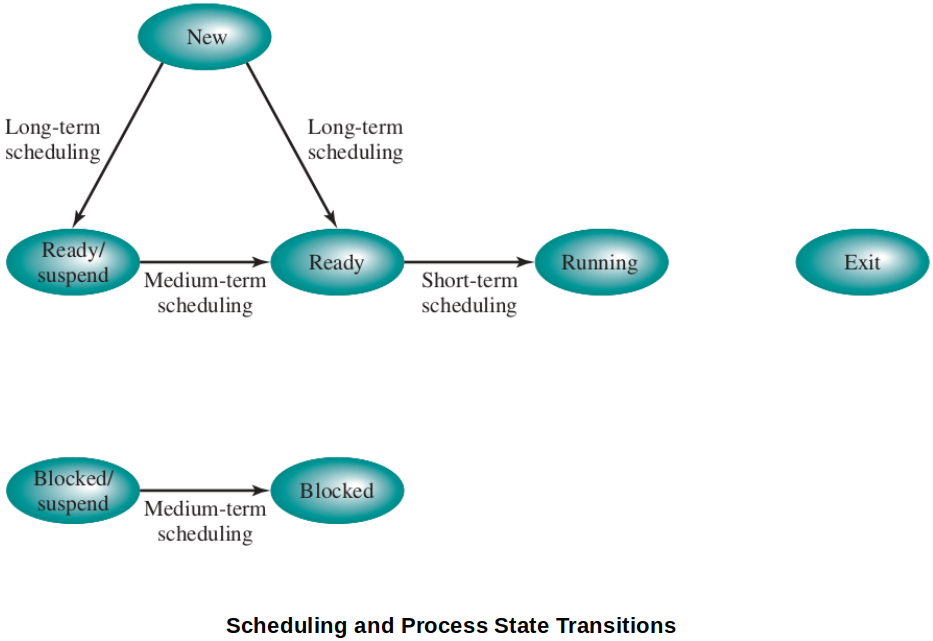

<a href="../">Notebook</a> > <a href="./">Operating Systems</a> > Types of Processor Scheduling

# Types of Processor Scheduling

## Processor Scheduling

* The aim of **processor scheduling** is to assign processes to be executed by the processor (or processors) over time, in a way that meets system objectives, such as response time, throughput, and processor efficiency.

* Processor scheduling activity is broken down into three separate functions. The names suggest the relative time scales with which these functions are performed.

  * **Long-term scheduling**

    The decision to add to the pool of processes to be executed.

  * **Medium-term scheduling**

    The decision to add to the number of processes that are partially or fully in main memory.

  * **Short-term scheduling**

    The decision as to which available process will be executed by the processor.

  [!] Note: **I/O scheduling** - The decision as to which process's pending I/O request shall be handled by an available I/O devices.

## Long-Term Scheduling

* Determines which programs are admitted to the system for processing.
* Controls the degree of multiprogramming.
  * The more processes that are created, the smaller the percentage of time that each process can be executed.
  * May limit to provide satisfactory service to the current set of processes.
* Executes the least fre

## Medium-Term Scheduling

## Short-Term Scheduling

## References

Stallings, W. (2018). *Operating Systems: Internals and Design Principles* (9th ed.). Pearson Education, Inc.

