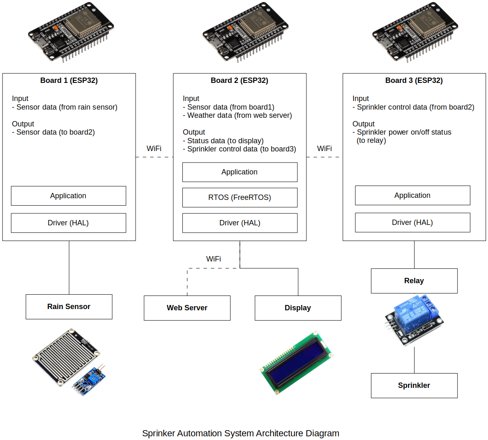

<a href="../">Home</a> > <a href="./">Portfolio</a> > Automated Sprinkler System

# Automated Sprinkler System (In Progress)

Source code: [https://github.com/kyungjae-lee/automated-sprinkler-system](https://github.com/kyungjae-lee/automated-sprinkler-system).

## Introduction

* Designing and implementing an embedded system that transforms a manual sprinkler controller into automated systems by integrating rain sensor data and web-based weather information
* This project aims to simplify gardening tasks through automated watering based on intelligently adjusted schedules and achieve water conservation by optimizing water usage.

## System Architecture

