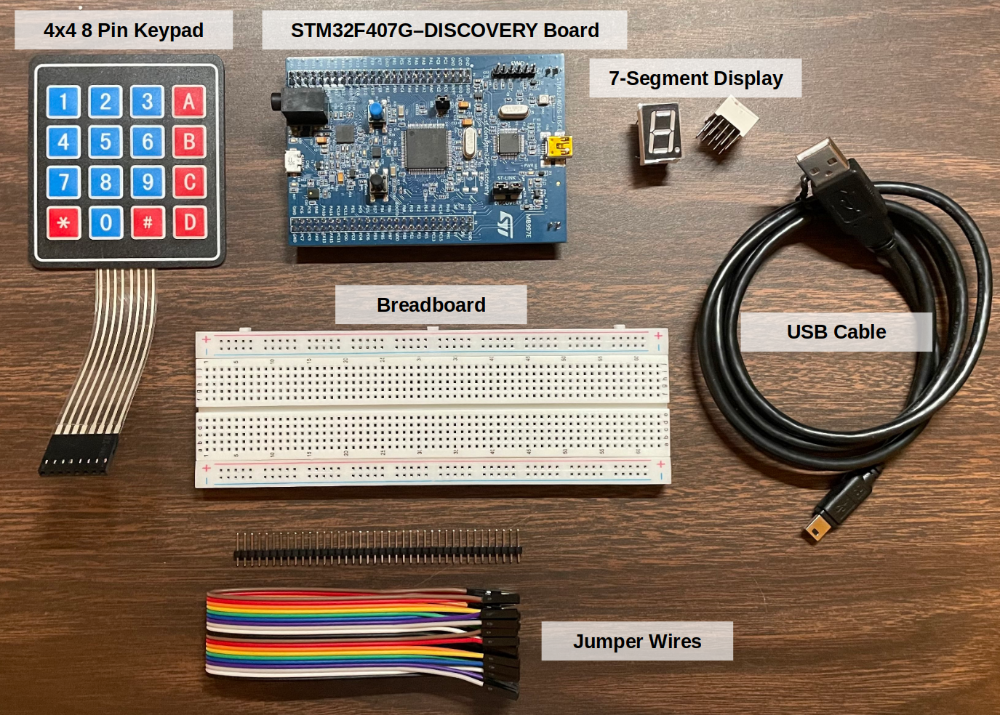

<a href="../">Notebook</a> > <a href="./">Projects</a> > 7-Segment Display Control with Keypad

# 7-Segment Display Control with Keypad

## Introduction

This project is to develop an embedded C program to control 7-segment display with keypad and STM32 board. 

## Objective

* To become familiar with controlling the General Purpose Input/Output (GPIO) of microcontroller (STM32x) by directly accessing and configuring the memory-mapped registers.
* To understand how the 4x4 keypad and 7-segment display interfacing works.
* To become familiar with referencing datasheets.

## Demonstration

This project is currently in progress. Demo video will be uploaded as soon as the project is complete.

## Development Environment

* **Hardware components**

* **Software**
  * STM32 CubeIDE (GCC compiler)
* **Host OS**
  * Ubuntu 22.04 LTS

## Source Code

This project is currently in progress. Demo video will be uploaded as soon as the project is complete.
