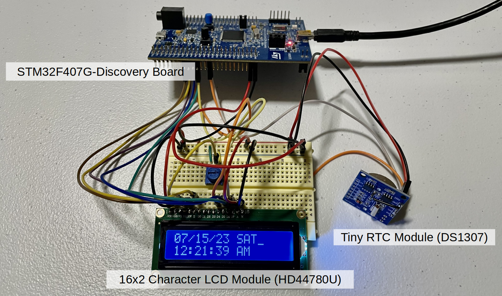
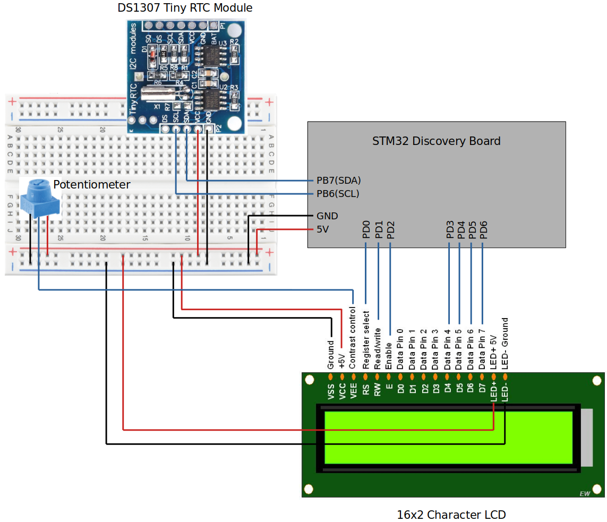

<a href="../">Home</a> > <a href="./">Projects</a> > LCD Digital Clock

# LCD Digital Clock

Source code: [https://github.com/kyungjae-lee/lcd-digital-clock](https://github.com/kyungjae-lee/lcd-digital-clock).

## Introduction

* Developed an application to read time and date information from the **Tiny RTC Module (DS1307)** and disaplay it on the **16x2 Character LCD (HD4478U)**
* Developed all software layers (HW abstraction layer, BSP layer, application layer) from scratch to implement an LCD Digital Clock

## Demonstration

<iframe width="560" height="315" src="https://www.youtube.com/embed/3YQeoxAJBNw" title="YouTube video player" frameborder="0" allow="accelerometer; autoplay; clipboard-write; encrypted-media; gyroscope; picture-in-picture; web-share" allowfullscreen></iframe>

## Development Environment

* Operating system: Ubuntu 22.04 LTS
* Integrated Development Environment (IDE): STM32 CubeIDE Version 1.10.1

## Architecture

### Hardware Components

### Communication Interfaces

### Wiring

### Software Layers

* **Application layer** implements the logic to read the current time and data information from the RTC module and display it on the LCD by using the APIs provided by the underlying software layers.
* **BSP layer** provides the application layer with the APIs to control the Tiny RTC Module (DS1307) and the 16x2 Character LCD Module (HD44780U).
* **Hardware abstraction layer** provides the BSP layer with the APIs to control the MCU peripherals such as GPIO, I2C and USART.
