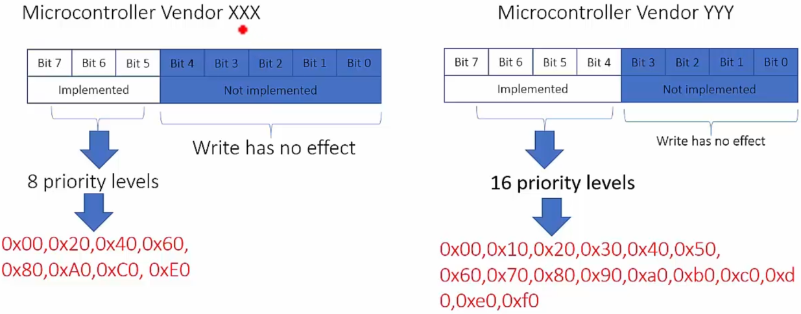
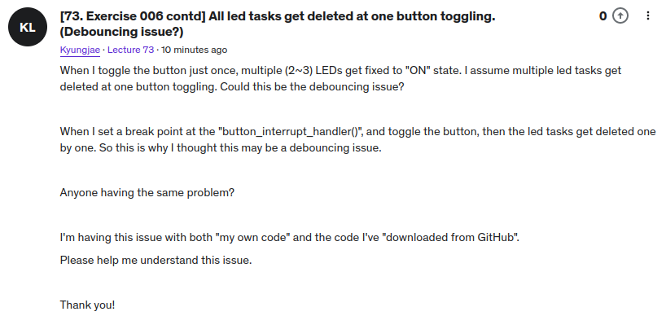

<a href="../">Notebook</a> > <a href="./">Real-Time Operating Systems (RTOS)</a> > ARM Cortex-M Interrupt Priority & FreeRTOS Task Priority

# ARM Cortex-M Interrupt Priority & FreeRTOS Task Priority


## Hardware Interrupt Priority (ARM Cortex-M)

* Hardware priority is the priority values assigned to various interrupts (i.e., MCU-specific, external to the processor) and system exceptions (i.e., processor-specific, internal to the processor) of the processor.

  Which of the lower or higher priority value means higher priority depends on the hardware design so you must check the documentation!!!


* When an interrupt occurs, corresponding Interrupt Service Routine (ISR) or Interrupt Handler gets invoked and runs in the "Handler mode" of the processor.

  ISR examples:

  ```c
  static void adc_interrupt_handler(void)
  {
      /* Interrupt handling for ADC peripheral */
  }
  ```

  ```c
  static void timer_interrupt_handler(void)
  {
      /* Interrupt handling for TIMER peripheral */
  }
  ```

  ```c
  static void uart_interrupt_handler(void)
  {
      /* Interrupt handling for UART peripheral */
  }
  ```


## FreeRTOS Task Priority vs. ARM Cortex-M Interrupt Priority

Don't be confused!


## FreeRTOS Hardware Interrupt Configuration Items

* In `FreeRTOSConfig.h` are 2 hardware interrupt configuration items:

  * `configKERNEL_INTERRUPT_PRIORITY`

  * `configMAX_SYSCALL_INTERRUPT_PRIORITY`

### `configKERNEL_INTERRUPT_PRIORITY`

* This configuration item **decides the priorities of the kernel interrupts**. These interrupts (SysTick, PendSV, SVC are set to the lowest possible priorities.)

* The kernel interrupts include:

  * **SysTick** exception (or interrupt)

    e.g., Maintains the system tick

    ```c
    #define configTICK_RATE_HZ ((portTickType)1000)
    ```

  * **PendSV** exception (or interrupt)

    e.g., Performs context switching

  * **SVC** exception (or interrupt)

    e.g., Launches the very first user task

* Definition

  ```c
  /* FreeRTOSConfig.h */
  
  /* Interrupt priorities used by the kernel port layer itself.  These are generic
  to all Cortex-M ports, and do not rely on any particular library functions. */
  #define configKERNEL_INTERRUPT_PRIORITY ( configLIBRARY_LOWEST_INTERRUPT_PRIORITY << (8 - configPRIO_BITS) )
  ```

  > * Kernel interrupts are assigned lowest possible priorities.
  >
  > * L5: `configLIBRARY_LOWEST_INTERRUPT_PRIORITY` is defined as `0xf` in the same file.

* What is the lowest and highest possible values in an ARM Cortex-M processor based microcontroller?

  * To answer this question, you need to know what the value of `__NVIC_PRIO_BITS` CMCIS macro is.

    ```c
    /* Project/Drivers/CMSIS/Device/ST/STM32F4xx/Include/stm32f407xx.h */
    
    #define __NVIC_PRIO_BITS 4U /*!< STM32F4XX uses 4 Bits for the Priority Levels */
    ```

    > * 4 bits $\to$ 16 possible priority values.
    >
    > * Priority register (0x00 is the highest priority) - Microcontroller-specific!
    >
    >   
    >
    > 

  * Therefore, `configKERNEL_INTERRUPT_PRIORITY` will be calculated to be `0xf0`, the lowest of the 16 priority levels possible.

### `configMAX_SYSCALL_INTERRUPT_PRIORITY`

* In the newer version of FreeRTOS Port file, its name has been changed to `configMAX_API_CALL_INTERRUPT_PRIORITY`.

* Decides the maximum priority level of those interrupts which use FreeRTOS APIs that end with `FromISR`.

  The priority value of an interrupt that ends with `FromISR` or an interrupt that calls an interrupt that ends with `FromISR` must be greater (i.e., lower priority) than this macro value.

  > Example (Do not assume ARM Cortex-M processor):
  >
  > Here, in this example, the lower the priority value the lower the priority.
  >
  > 
  >
  > 
  >
  > Interrupts that do not call API functions can execute at the priorities above `configMAX_SYSCALL_INTERRUPT_PRIORITY` and therefore never be delayed by the RTOS kernel execution.

* Definition

  ```c
  /* FreeRTOSConfig.h */
  
  /* !!!! configMAX_SYSCALL_INTERRUPT_PRIORITY must not be set to zero !!!!
  See http://www.FreeRTOS.org/RTOS-Cortex-M3-M4.html. */
  #define configMAX_SYSCALL_INTERRUPT_PRIORITY 	( configLIBRARY_MAX_SYSCALL_INTERRUPT_PRIORITY << (8 - configPRIO_BITS) )
  ```

  > L5: `configLIBRARY_MAX_SYSCALL_INTERRUPT_PRIORITY` is defined as 5 in the same file, so `5 << (8 - 4)` equals 0x50.
  >
  > 
  >
  > 

### Conclusion

* FreeRTOS APIs that end with `FromISR` are interrupt-safe. But, even these APIs should NOT be called from the ISRs that are of lower priority value (i.e., higher priority) than the value defined by `configLIBRARY_MAX_SYSCALL_INTERRUPT_PRIORITY`.
* Therefore, any ISR that uses an RTOS API function must have its priority value manually set to a value that is greater than or equal to the value defined by `configLIBRARY_MAX_SYSCALL_INTERRUPT_PRIORITY`.
* ARM Cortex-M interrupts default to having a priority value of 0. This is the highest possible priority value. Therefore, NEVER leave the priority of an interrupt that uses the interrupt-safe RTOS API at tis default value.


## FreeRTOS `FromISR` APIs

* FreeRTOS provides separate APIs for use from interrupt handlers. These APIs end with `FromISR`.

* If a FreeRTOS API doesn't end with `FromISR`, then it should not be used in an interrupt context (i.e., inside an ISR).

  For example:

  ```c
  /* Task handler */
  void led_red_handler(void *parameters)
  {
      while (1)
      	xQueueSend();	// cannot use 'xQueueSendFromISR()'
  }
  ```

  ```c
  /* Interrupt handler */
  void uart_interrupt_handler(void)
  {
      xQueueSendFromISR();	// cannot use 'xQueueSend()'
  }
  ```

  

## Exercise (006_LED_Button_ISR)

* Implement ISR-to-task notification using direct notification APIs of FreeRTOS.

  Create 3 tasks that toggle 3 different LEDs of the STM32F407 Discovery board.

  Upon the button press, the button interrupt handler must run, and it should send the notification to the current LED toggling task.

  When LED toggling task receives the notification, it should delete itself.


### Project Setup

* Go through all the process you went through to setup the **Exercise: 005_LED_Task_Notify**.
* Do the following GPIO configuration.


* GPIO `PA0` is connected to `EXTI line0 interrupt`. So do the following setup.


* Call `button_interrupt_handler()` from `EXTI0_IRQHandler()` shown in the file above and implement it in `main.c`. (Make sure to declare this function as `extern` in the file.)

  Also, clear the pending bit for `GPIO_PIN_0`.

  ```c
  /* stm32f4xx_it.c */
  ...
  void EXTI0_IRQHandler(void)
  {
    /* USER CODE BEGIN EXTI0_IRQn 0 */
    button_interrupt_handler();
      
    // clear EXTI 0 pending bit in the exti pending register
    HAL_GPIO_EXTI_IRQHandler(GPIO_PIN_0);
    /* USER CODE END EXTI0_IRQn 0 */
    ...
  }
  ```

* Implement `button_interrupt_handler()`.

  ```c
  /* main.c */
  ...
      
  /* USER CODE BEGIN 4 */
  
  void button_interrupt_handler(void)
  {
  	traceISR_ENTER(); // to monitor the entry of the ISR from the SEGGER SystemView
  	xTaskNotifyFromISR(next_task_handle, 0, eNoAction, NULL);
  	traceISR_EXIT();
  }
  
  ...
  ```

* Update `led_green_handler()`. Here, the shared variable `next_task_handle` is also shared with the ISR which is not a user task, so synchronizing the access to this variable using `vTaskSuspendAll()`/`vTaskResumeAll()` will not work!

  Use `portENTER_CRITICAL()`/`portEXIT_CRITICAL()` which is implemented in `port.c` instead. This will disable interrupts. However, in general, disabling interrupts is not recommended. If this is the case, use **mutex** or **semaphore** instead.

  ```c
  /* main.c */
  ...
  static void led_green_handler(void *parameters)
  {
  	BaseType_t status;
  	while (1)
  	{
  		SEGGER_SYSVIEW_PrintfTarget("Toggling green LED");
  		HAL_GPIO_TogglePin(GPIOD, LED_GREEN_PIN);
  		status = xTaskNotifyWait(0, 0, NULL, pdMS_TO_TICKS(1000));
  
  		// if notification was received
  		if (status == pdTRUE)
  		{
  			// synchronization using 'portENTER_CRITICAL()' and 'portEXIT_CRITICAL()'
  			portENTER_CRITICAL();	
  			next_task_handle = ledo_task_handle;
  
  			HAL_GPIO_WritePin(GPIOD, LED_GREEN_PIN, GPIO_PIN_SET);
  
  			// self delete by passing NULL
  			SEGGER_SYSVIEW_PrintfTarget("Delete green LED task");
  			portEXIT_CRITICAL();
  			
  			vTaskDelete(NULL);
  		}
  	}
  }
  ```

* If you are copying the `main.c` from the previous exercise, make sure to remove everything related to `button_handler` since we are no longer using that task to send notification upon button press. We are using ISR in this exercise.

* Analyze using SEGGER SystemView.

  I faced a problem with this exercise. Left the question on the Q&A board.





## References

Nayak, K. (2022). *Mastering RTOS: Hands on FreeRTOS and STM32Fx with Debugging* [Video file]. Retrieved from https://www.udemy.com/course/mastering-rtos-hands-on-with-freertos-arduino-and-stm32fx/

