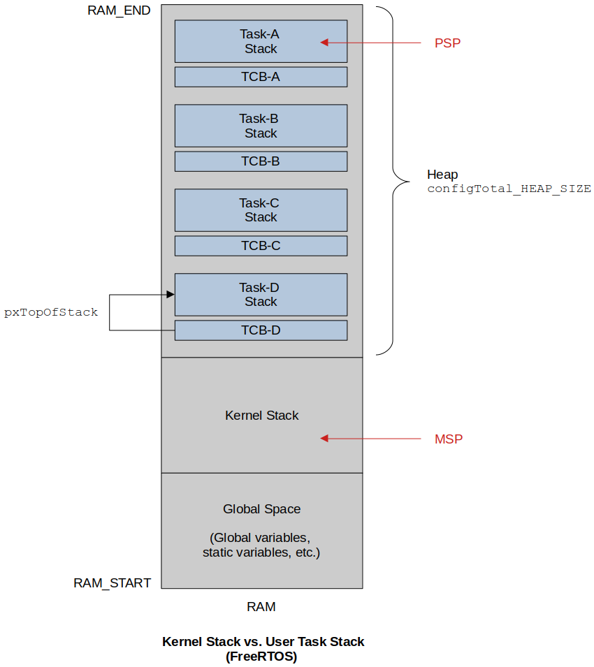

<a href="../">Notebook</a> > <a href="./">Real-Time Operating Systems (RTOS)</a> > Context Switching

# Context Switching


## Context Switching

* Context switching is a process of switching out of one task and switching in another taask on the CPU to execute.

* In RTOS context switching is taken care of by the scheduler.

* In FreeRTOS context switching is taken care of by the PendSV handler defined in `port.c`.

* Whether context switch should happen or note depends upon the scheduling policy of the scheduler. 

* Priority-based preemptive scheduler - For every RTOS tick interrupt, the scheduler will compare the priority of the running task with the priorities of the tasks in the Ready list. If there is any Ready task whose priority is higher than the running task then the context switch will occur.

* On FreeRTOS you can also trigger context switch manually using the macro `taskYIELD()`.

  ```c
  /* task.h */
  #define taskYIELD()	portYIELD()
  ```

  ```c
  /* portmacro.h */
  /* Scheduler utilities. */
  #define portYIELD()                                 \
  {                                                   \
  	/* Set a PendSV to request a context switch. */ \
  	portNVIC_INT_CTRL_REG = portNVIC_PENDSVSET_BIT; \
      ...        
  }
  ```

  > L6: What it does is identical to what the SysTick does. It pends the PendSV interrupt which means triggering the context switch manually.

* Context switch also happens immediately whenever new task unblocks and if its priority is higher than the currently running task.


## State of a Task

See [Scheduling & Context Switching](https://kyungjae.dev/embedded-systems-programming-arm/scheduling-and-context-switching) for processor level details.

* When a task executes on the processor it utilizes

  * Processor core registers (among them PSP is for user tasks, MSP is for kernel)

  * Task's own stack memory (if a task wants to do any push/pop operations during function call)

  **State of a task** = [Processor core registers] + [Task's stack memory]


## Stacks

* Two categories of stack memory utilized during the run-time of a FreeRTOS based application:

  * **Task's private stack (Process stack)** - Used when a task does push/pop

    Push/pop to/from this stack space is tracked by the **PSP** register of the ARM Cortex-M processor.

  * **Kernel stack (Main stack)** - Used when an ISR (e.g., SysTick handler, PendSV handler) does push/pop

    Push/pop to/from this stack space is tracked by the **MSP** register of the ARM Cortex-M processor.





## References

Nayak, K. (2022). *Mastering RTOS: Hands on FreeRTOS and STM32Fx with Debugging* [Video file]. Retrieved from https://www.udemy.com/course/mastering-rtos-hands-on-with-freertos-arduino-and-stm32fx/

