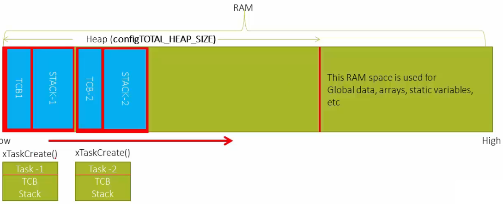
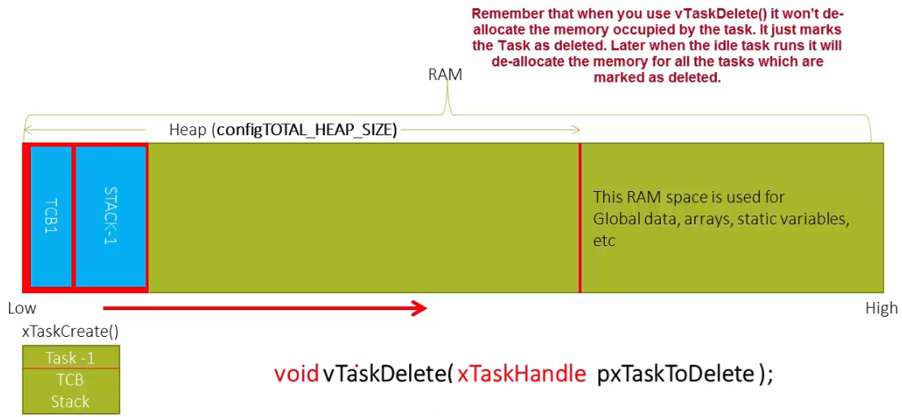
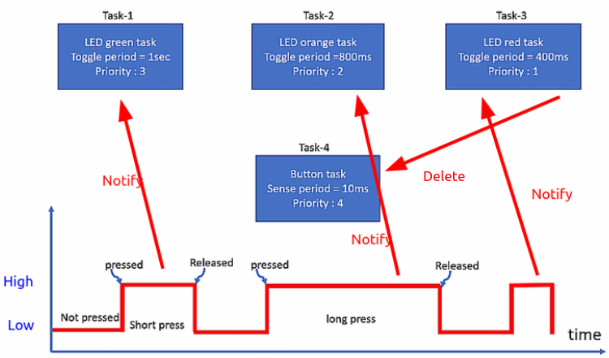

<a href="../../">Home</a> > <a href="../notebook">Notebook</a> > <a href="./">Real-Time Operating Systems (RTOS)</a> > Deleting a Task

# Deleting a Task

## Creating a Task

* `xTaskCreate()` is used to create a task.

## Deleting a Task

* `vTaskDelete()` is used to delete a task.

  This API just mark the task as "deleted" and does NOT free the memory the task is occupying. It is the responsibility of the **Idle task** to free the deleted task's memory.

* Due to the nature of RTOS, tasks do not get deleted most of the time. Instead, tasks that are not necessary are moved to the Blocked state so it can wait without consuming CPU cycles. However, if, by any chance, you need to delete a task, this is the way to go.

## Exercise

* Implement the task notification using direct notification APIs of FreeRTOS.

  * Create 3 tasks that toggle 3 different LEDs of the STM32F407 Discovery board. (Task-1, Task-2, Task-3)

  * Create a button task that polls for the button press for every 10 ms. (Task-4)

    If the button press did not last longer than this time period, it will not be recognized.

    Task-4 is of the highest priority.

  * If the button task detects button press, it should send a notification to LED toggling task.

  * When Task-3 deletes itself, it also deletes Task-4 since it is no longer needed.

  

* Use `USER & WAKE-UP Button`. See the schematics of the board.
* In this program, threads access to the shared variable `next_task_handle`. To synchronize this access, we'll use the following APIs around the critical section.
  * `vTaskSuspendAll()` to suspend the scheduler (i.e., preventing context switch temporarily)
  * `xTaskResumeAll()` to resume the scheduler

## References

Nayak, K. (2022). *Mastering RTOS: Hands on FreeRTOS and STM32Fx with Debugging* [Video file]. Retrieved from https://www.udemy.com/course/mastering-rtos-hands-on-with-freertos-arduino-and-stm32fx/

