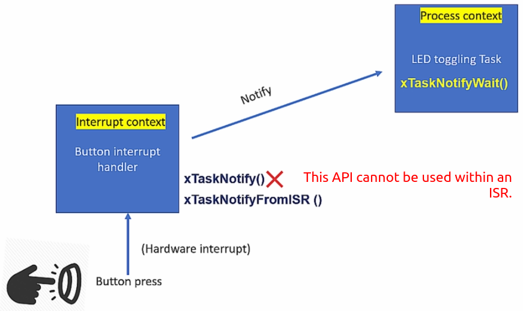
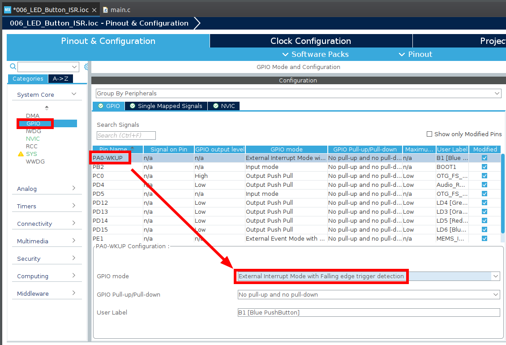
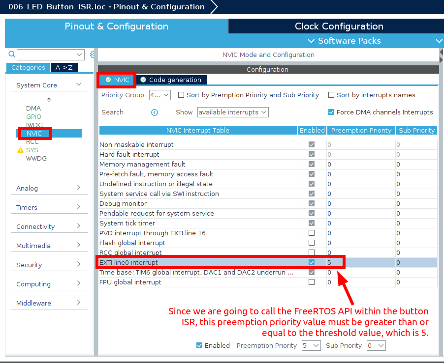
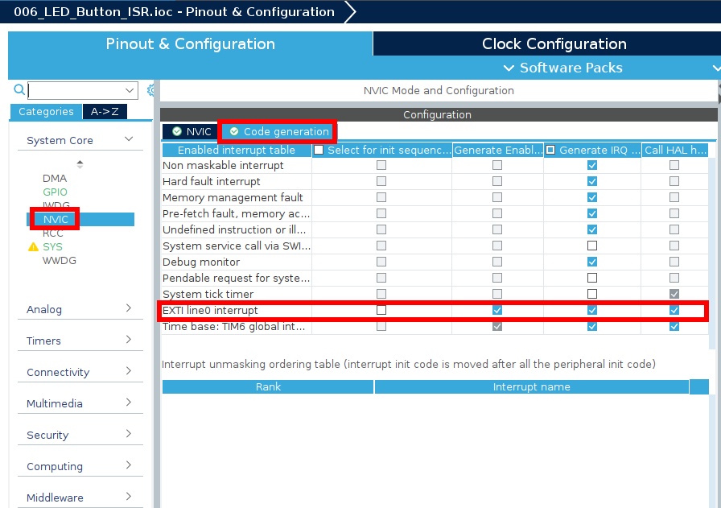
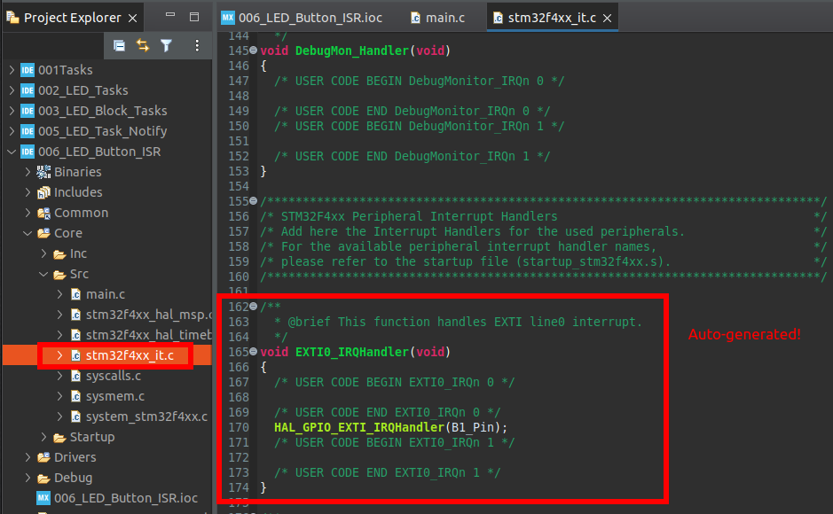
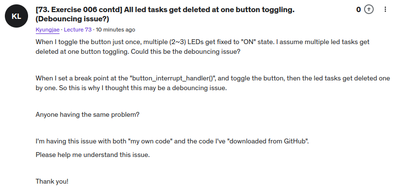
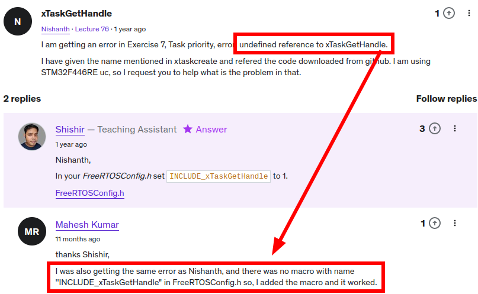
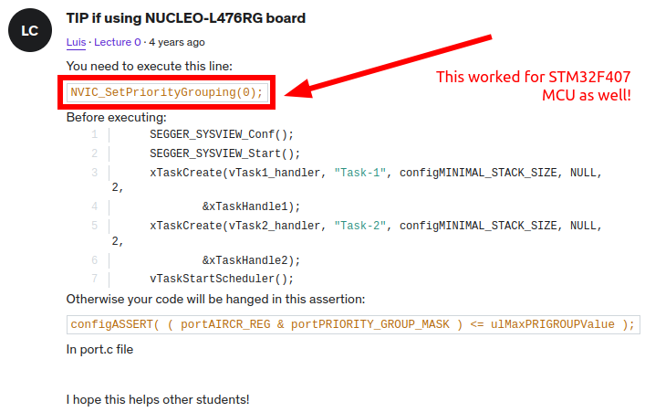

<a href="../../">Home</a> > <a href="../notebook">Notebook</a> > <a href="./">Real-Time Operating Systems (RTOS)</a> > Exercise: FreeRTOS `FromISR` & Task Priority (`06_LED_Button_ISR`, `07_Task_Priority`)

# Exercise: FreeRTOS `FromISR` & Task Priority (`06_LED_Button_ISR`, `07_Task_Priority`)


## Exercise: FreeRTOS `FromISR` (`06_LED_Button_ISR`)

### Problem Statement

* Implement ISR-to-task notification using direct notification APIs of FreeRTOS.

  Create 3 tasks that toggle 3 different LEDs of the STM32F407 Discovery board.

  Upon the button press, the button interrupt handler must run, and it should send the notification to the current LED toggling task.

  When LED toggling task receives the notification, it should delete itself.





### Project Setup

* Go through all the process you went through to setup the **Exercise: 005_LED_Task_Notify**.
* Do the following GPIO configuration.





* GPIO `PA0` is connected to `EXTI line0 interrupt`. So do the following setup.











* Call `button_interrupt_handler()` from `EXTI0_IRQHandler()` shown in the file above and implement it in `main.c`. (Make sure to declare this function as `extern` in the file.)

  Also, clear the pending bit for `GPIO_PIN_0`.

  ```c
  /* stm32f4xx_it.c */
  ...
  void EXTI0_IRQHandler(void)
  {
    /* USER CODE BEGIN EXTI0_IRQn 0 */
    button_interrupt_handler();
      
    // clear EXTI 0 pending bit in the exti pending register
    HAL_GPIO_EXTI_IRQHandler(GPIO_PIN_0);
    /* USER CODE END EXTI0_IRQn 0 */
    ...
  }
  ```

* Implement `button_interrupt_handler()`.

  ```c
  /* main.c */
  ...
      
  /* USER CODE BEGIN 4 */
  
  void button_interrupt_handler(void)
  {
  	traceISR_ENTER(); // to monitor the entry of the ISR from the SEGGER SystemView
  	xTaskNotifyFromISR(next_task_handle, 0, eNoAction, NULL);
  	traceISR_EXIT();
  }
  
  ...
  ```

* Update `led_green_handler()`. Here, the shared variable `next_task_handle` is also shared with the ISR which is not a user task, so synchronizing the access to this variable using `vTaskSuspendAll()`/`vTaskResumeAll()` will not work!

  Use `portENTER_CRITICAL()`/`portEXIT_CRITICAL()` which is implemented in `port.c` instead. This will disable interrupts. However, in general, disabling interrupts is not recommended. If this is the case, use **mutex** or **semaphore** instead.

  ```c
  /* main.c */
  ...
  static void led_green_handler(void *parameters)
  {
  	BaseType_t status;
  	while (1)
  	{
  		SEGGER_SYSVIEW_PrintfTarget("Toggling green LED");
  		HAL_GPIO_TogglePin(GPIOD, LED_GREEN_PIN);
  		status = xTaskNotifyWait(0, 0, NULL, pdMS_TO_TICKS(1000));
  
  		// if notification was received
  		if (status == pdTRUE)
  		{
  			// synchronization using 'portENTER_CRITICAL()' and 'portEXIT_CRITICAL()'
  			portENTER_CRITICAL();	
  			next_task_handle = ledo_task_handle;
  
  			HAL_GPIO_WritePin(GPIOD, LED_GREEN_PIN, GPIO_PIN_SET);
  
  			// self delete by passing NULL
  			SEGGER_SYSVIEW_PrintfTarget("Delete green LED task");
  			portEXIT_CRITICAL();
  			
  			vTaskDelete(NULL);
  		}
  	}
  }
  ```

* If you are copying the `main.c` from the previous exercise, make sure to remove everything related to `button_handler` since we are no longer using that task to send notification upon button press. We are using ISR in this exercise.

* Analyze using SEGGER SystemView.

  I faced a problem with this exercise. Left the question on the Q&A board.





## Exercise: Task Priority (`07_Task_Priority`)

* Write an application that creates 2 tasks:

  * Task-1 
    * Priority value: 2
    * Continuous task
    * Toggles the red LED with 100 ms ON/OFF duration 
  * Task-2 
    * Priority value: 3
    * Continuous task
    * Toggles the green LED with 1 s ON/OFF duration 

  When the user button is pressed, the priority of the tasks should be exchanged. (i.e., Task-1's priority must be reconfigured for Task-2's priority and vice versa.)

* Check the following 2 APIs that helps reconfiguring the FreeRTOS value of a task.
  * `uxTaskPriorityGet()`
  * `vTaskPrioritySet()`

* Error fixes!








## References

Nayak, K. (2022). *Mastering RTOS: Hands on FreeRTOS and STM32Fx with Debugging* [Video file]. Retrieved from https://www.udemy.com/course/mastering-rtos-hands-on-with-freertos-arduino-and-stm32fx/
