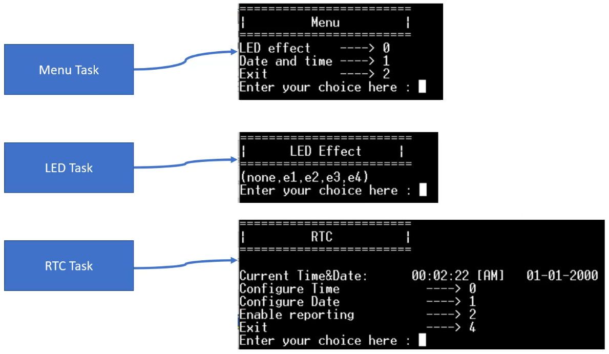
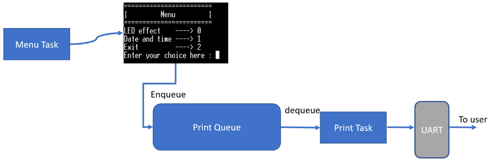
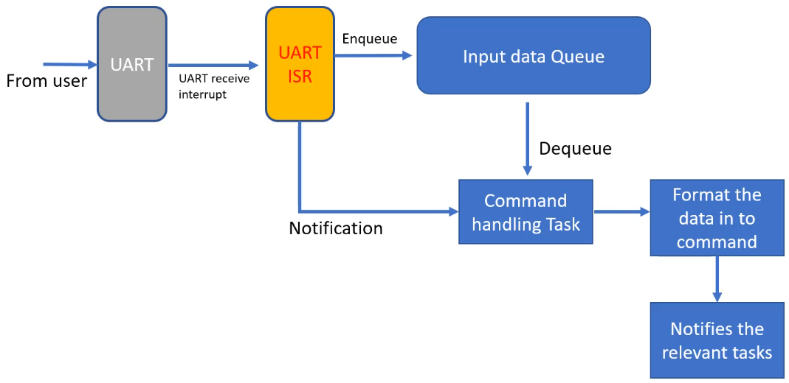

<a href="../../">Home</a> > <a href="../notebook">Notebook</a> >  <a href="./">Real-Time Operating Systems (RTOS)</a> > Exercise: Queues and Timers (`09_Queues_and_Timers`)

# Exercise: Queues and Timers (`09_Queues_and_Timers`)


## Problem Statement

* Write a FreeRTOS application that takes input (commands) from the user over UART and handles LED and real-time clock (RTC) peripheral of the microcontroller.
* This application implements:
  1. Processing user sent commands over UART
  2. Handling of FreeRTOS queues
     * Print queue
     * Input data queue
  3. FreeRTOS software timers

### FreeRTOS tasks to implement and the Application Flow

* **Menu task**
  * Sends the pointer to the message to be printed on the console to the "print queue".
  * It does not directly control the UART peripheral.
* **LED task**
* **RTC task**





* **Print task**
  * Receives from the "print queue" the pointer to the message to be printed.
  * The only task to control the UART peripheral to handle writing data to the console





* **Command handling task**
  * Whenever the USART ISR detects a new line character `\n`, it will send a notification to the "command handling task." Subsequently, the "command handling task" will dequeue the entire command from the "input data queue" and format the data into a command. And then, this command will notify the relevant tasks. 





### Guideline

1. Create a new project

2. Create `main.c`, `task_hanlder.c`, `led_effect.c`, and `rtc.c`

3. In the main function, create:

   * 5 tasks (use the same priority for all tasks $\to$ 2)

     ```c
     /* Example */
     
     status = xTaskCreate(menu_task, "menu_task", 250, NULL, 2, &handle_menu_task);
     ```

   * 2 queues


## References

Nayak, K. (2022). *Mastering RTOS: Hands on FreeRTOS and STM32Fx with Debugging* [Video file]. Retrieved from https://www.udemy.com/course/mastering-rtos-hands-on-with-freertos-arduino-and-stm32fx/

