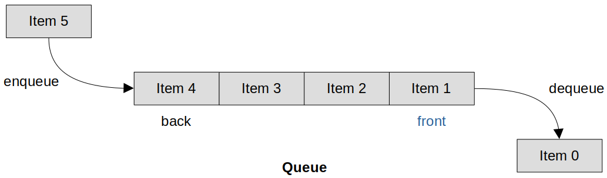

<a href="../../">Home</a> > <a href="../notebook">Notebook</a> >  <a href="./">Real-Time Operating Systems (RTOS)</a> > FreeRTOS Queue Management

# FreeRTOS Queue Management

## FreeRTOS Queue

* Items are **enqueue**d to the front (or head) of the queue, and **dequeue**d from the back (or tail) of the queue.

## References

Nayak, K. (2022). *Mastering RTOS: Hands on FreeRTOS and STM32Fx with Debugging* [Video file]. Retrieved from https://www.udemy.com/course/mastering-rtos-hands-on-with-freertos-arduino-and-stm32fx/

