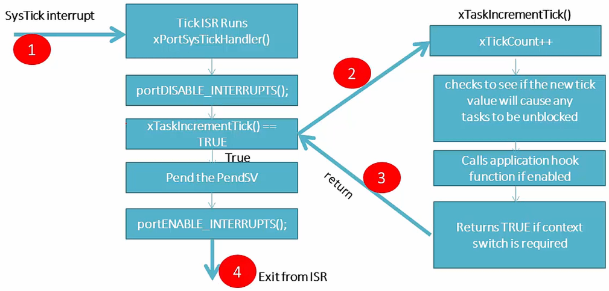

<a href="../../">Home</a> > <a href="../notebook">Notebook</a> > <a href="./">Real-Time Operating Systems (RTOS)</a> > FreeRTOS Scheduler Implementation

# FreeRTOS Scheduler Implementation


## FreeRTOS Scheduler Internals

* In FreeRTOS the scheduler code is a combination of 

  * **FreeRTOS generic code (`tasks.c`)**

    * `vTaskStartScheduler()` is a generic function for all architectures  `task.c`
    * It calls `xPortStartScheduler()` defined in `port.c` which does the architecture-specific initializations.

  * **Architecture specific code (`port.c`, `portmacro.h`)**

    `xPortStartScheduler()` defined in `port.c` does the following architecture-specific initializations:

    * Configuring the SysTick timer to issue interrupts at a desired rate.
    * Make the PendSV and SysTick the lowest priority interrupts.
    * Starting the very first task (`prvPortStartFirstTask()`) by executing the SVC instruction.


## Architecture-Specific Interrupts that Implement the Scheduler

* When FreeRTOS runs on ARM Cortex-M processor based MCU, the following kernel interrupts defined in `port.c` are used to implement the scheduler.
  * SVC Interrupt (`vPortSVCHandler()`) - Used to <u>launch the very first task</u> (only called once!). Triggered by SVC instruction of ARM Cortex-M processor.
  * PendSV Interrupt (`xPortPendSVHandler()`) - Used to achieve the <u>context switching</u> between tasks. Triggered by pending the PendSV system exception of ARM Cortex-M processor.
  * SysTick Interrupt (`xPortSysTickHandler()`) - Used to implement the <u>RTOS tick management</u>. Triggered periodically at a desired rate by the SysTick timer of ARM Cortec-M processor.

* If SysTick interrupt is used for some other purpose in your application, you may use any other available timer peripheral.
* All interrupts are configured at the lowest possible interrupt priority.


## RTOS Ticking

* RTOS ticking is implemented using timer hardware of the MCU. e.g., SysTick timer in the case of ARM Cortex-M processor.

* RTOS tick is necessary for the kernel to keep track of the time elapsed. (A global variable `xTickCount` which gets incremented by one every tick is used.)

* Tick interrupt is triggered at the rate of `configTICK_RATE_HZ` defined in `FreeRTOSConfig.h`.

* Each timer tick interrupt triggers the scheduler to perform context switching. The context switching occurs in the following process:

  1. Upon the execution of the tick ISR
  2. All the tasks in the Read state are scanned
  3. The task to run next is determined
  4. If found, context switching is triggered by pending the PendSV ISR
  5. The PendSV handler takes care of the context switching

* Where does the RTOS tick timer get configured?

  `vTaskStartScheduler()`(`tasks.c`) $\to$ `xPortStartScheduler()`(`port.c`):

  1. Make the PendSV and SysTick the lowest priority interrupts.

     ```c
     /* port.c */
     /* Make PendSV and SysTick the lowest priority interrupts. */
     portNVIC_SHPR3_REG |= portNVIC_PENDSV_PRI;
     portNVIC_SHPR3_REG |= portNVIC_SYSTICK_PRI;
     ```

     If you keep tracking the macros you will reach

     ```c
     /* FreeRTOSConfig.h */
     /* The lowest interrupt priority that can be used in a call to a "set priority" function. */
     #define configLIBRARY_LOWEST_INTERRUPT_PRIORITY			0xf
     ```

     > 15 is the lowest possible 4-bit priority value.

  2. Enables the Systick timer interrupt and starts the timer.

     ```c
     /* port.c */
     /* Start the timer that generates the tick ISR.  Interrupts are disabled here already. */
     vPortSetupTimerInterrupt();
     ```

     Inside this function, the `configTICK_RATE_HZ` value will get loaded to the SysTick timer.

     ```c
     /* port.c */
     /* Configure SysTick to interrupt at the requested rate. */
     portNVIC_SYSTICK_LOAD_REG = ( configSYSTICK_CLOCK_HZ / configTICK_RATE_HZ ) - 1UL;
     portNVIC_SYSTICK_CTRL_REG = ( portNVIC_SYSTICK_CLK_BIT | portNVIC_SYSTICK_INT_BIT | 
                                   portNVIC_SYSTICK_ENABLE_BIT );
     ```

     > L3: Load the value. (See *The RTOS Tick Configuration* section below to see how the load value is obtained.)
     >
     > L4: Enable SysTick. This is where the down-counting gets started.





## The RTOS Tick Configuration

* `configSYSTICK_CLOCK_HZ = configCPU_CLK_HZ`

* If `configCPU_CLK_HZ = 25000000` (i.e., 25 MHz), and `configTICK_RATE_HZ = 1000` (i.e., 1000 Hz), then `portsSYSTICK_NVIC_LOAD_REG = (25000000 / 1000) - 1` (i.e., 24999)

  The SysTick timer, when started, dounts down from 24999 to 0. It generates an interrupt when the count value reaches 0 and again reloads the load count value.

  Therefore, 24999 is the SysTick load value required to generate interrupt for every 1 ms (1000 Hz).


## References

Nayak, K. (2022). *Mastering RTOS: Hands on FreeRTOS and STM32Fx with Debugging* [Video file]. Retrieved from https://www.udemy.com/course/mastering-rtos-hands-on-with-freertos-arduino-and-stm32fx/

