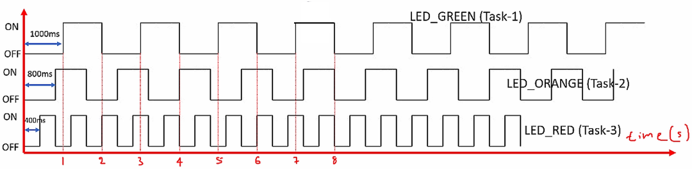
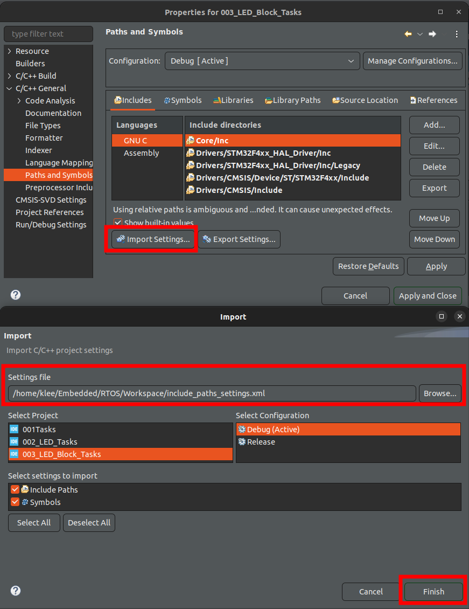

<a href="../../">Home</a> > <a href="../notebook">Notebook</a> > <a href="./">Real-Time Operating Systems (RTOS)</a> > FreeRTOS Task Delay APIs

# FreeRTOS Task Delay APIs


## FreeRTOS Task Delay APIs

### 1. `vTaskDelay()`

* Prototype

  ```c
  /* task.h */
  void vTaskDelay( const TickType_t xTicksToDelay );
  ```

  > * `xTicksToDelay` - The amount of time, in tick periods, that the calling task should block.

* Delay a task for a given number of **ticks**.

* The actual time that the task remains blocked depends on the tick rate. The constant `portTICK_PERIOD_MS` can be used to calculate real time from the tick rate - with the resolution of one tick period.

* `vTaskDelay()` specifies a time at which the task wishes to unblock **relative to** the time at which `vTaskDelay()` is called.  For example, specifying a block period of 100 ticks will cause the task to unblock 100 ticks after `vTaskDelay() `is called.  

### 2. `vTaskDelayUntil()`

* Prototype

  ```c
  /* task.h */
  void vTaskDelayUntil( TickType_t *pxPreviousWakeTime, const TickType_t xTimeIncrement );
  ```

  > * `pxPreviousWakeTime` - Pointer to a variable that holds the time at which the task was last unblocked.  The variable must be initialized with the current time prior to its first use (see the example below).  Following this the variable is automatically updated within `vTaskDelayUntil()`. 
  >
  >   $\to$ This parameter will get updated inside `vTaskDelayUntil()` automatically.
  >
  > * `xTimeIncrement` - The cycle time period.  The task will be unblocked at time (`pxPreviousWakeTime` + `xTimeIncrement`).  Calling `vTaskDelayUntil()` with the same `xTimeIncrement` parameter value will cause the task to execute with a fixed interval period.
  >
  >   $\to$ User must specify this value.

* Delay a task until a specified **time**. This function can be used by periodic tasks to ensure a constant execution frequency.

* This function differs from `vTaskDelay()` in one important aspect:  `vTaskDelay()` specifies a time at which the task wishes to unblock *relative* to the time at which `vTaskDelay()` is called, whereas `vTaskDelayUntil()` specifies an *absolute* time at which the task wishes to unblock.

[!] Note: To learn more about these APIs, consult [https://www.freertos.org/](https://www.freertos.org/) $\to$ Kernel $\to$ API Reference $\to$ Task Control. Make sure to understand the difference between these two APIs.


## Why Use Them?

1. Delay a task without engaging the processor (replacement for `for`/`while` loop based crude delay implementation)

   $\to$ Use `vTaskDelay()`.

2. Implementation of periodic tasks

   $\to$ Use `vTaskDelayUntil()`.

   Periodic tasks:

   * Task which executes with a fixed execution period in the timeline.
   * To achieve fixed periodicity of a task, use `vTaskDelayUntil()` instead of `vTaskDelay()`.
   * Fixed periodicity (i.e., task waking up and moving to the Ready state) is not guaranteed if `vTaskDelay()` is used to implement the periodic tasks.


## Examples

### 1. `vTaskDelay()`

* Generate delay of 10 ms

  Using `for` loop (NOT preferred):

  ```c
  for (int i = 0; i < 5000; i++);		// implements delay by running on CPU for 10 ms
  ```

  > This code runs on the CPU continuously for 10 ms, starving other lower priority tasks.
  >
  > Avoid using `for`/`while` loop-based delay implementation, which doesn't do any genuine work but still consumes the CPU.
  >
  > Using `for`/`while` loop for delay implementation may also prevent any lower priority task from running on the CPU during the delay.

  Using API (Preferred):

  ```c
  vTaskDelay(10);		// implements delay without running on CPU for 10 ticks
  					// (if 'configTICK_RATE_HZ = 1000 Hz', this will delay for 10 ms)
  ```

  > This is blocking delay API that blocks the task for 10 ms. During that time, other Ready tasks in the system can be dispatched and run on CPU. After 10 ms, the blocked task wakes up and enters the Ready state.

* Example usage:

  ```c
  void vTaskFunction( void * pvParameters )
  {
      /* Block for 500ms. */
      const TickType_t xDelay = 500 / portTICK_PERIOD_MS;
  
      for( ;; )
      {
          /* Simply toggle the LED every 500ms, blocking between each toggle. */
          vToggleLED();
          vTaskDelay( xDelay );
      }
  }
  ```

### 2. `vTaskDelayUntil()`

* Example usage:

  ```c
  // Perform an action every 10 ticks.
  void vTaskFunction(void * pvParameters)
  {
      TickType_t xLastWakeTime;
      const TickType_t xFrequency = 10;
  
      // Initialise the xLastWakeTime variable with the current time. (One time initialization)
      xLastWakeTime = xTaskGetTickCount();
  
      for( ;; )
      {
          // Wait for the next cycle.
          vTaskDelayUntil(&xLastWakeTime, xFrequency);
  
          // Perform action here.
      }
  }
  ```

  

## Milliseconds to Ticks Conversion

* Equation

  ```c
  xTicksToWait = (xTimeInMs * configTICK_RATE_HZ) / 1000
  ```

* Example

  If `configTICK_RATE_HZ` is 500, then SysTick interrupt (RTOS tick) is going to occur ever 2 ms. So, 500 ms of delay is equivalent to 250 RTOS tick.


## Summary

* If you want to implement delay functionality inside your task function, use `vTaskDelay()` instead of crude `for`/`while` loop-based delay.
* If you want to implement a task that must execute with a fixed execution period (i.e., periodic task), then use `vTaskDelayUntil()`.


## Exercise 1 (LED_Block_Tasks)

* Toggle 3 LEDs of the STM32F407 Discovery board with the duration as shown in the graph below.

  

  

  

* Create 3 FreeRTOS tasks of the same priority to handle three different LDEs.

* Use `vTaskDelay()` for delay implementation.

### Project Setup

* Create a project.
* Link `Common` folder into the project. (Make sure to uncheck `Exclude resource from build` option. Otherwise, you'll end up with a bunch of "undefined reference" errors.)
* Import "Include paths" by using previously saved configuration files.





* Copy `FreeRTOSConfig.h` from an earlier project into `Project/Core/Inc/`, and update it according to your project's requirement.

  Make sure:

  ```c
  /* FreeRTOSConfig.h */
  #define INCLUDE_vTaskDelay 1	// necessary to use vTaskDelay() API
  ```

* Copy `main.c` from an earlier project (i.e., Toggle LEDs) and update it to your needs.

  ```c
  /* main */
  // HAL_Delay(1000);					// previously (blocking delay)
  vTaskDelay(pdMS_TO_TICKS(1000));	// non-blocking delay
  ```

* Copy from an earlier project's (i.e., Toggle LEDs) `main.h` the user defined macros:

  ```c
  /* USER CODE BEGIN Private defines */
  #define LED_GREEN_PIN	LD4_Pin
  #define LED_ORANGE_PIN	LD3_Pin
  #define LED_RED_PIN		LD5_Pin
  /* USER CODE END Private defines */
  ```

* In `Project/Core/Src/stm32f4xx_hal_msp.c`, add ``vInitPrioGroupValue();` as shown in L15. And, include `FreeRTOSConfig.h`.

  ```c
  /* stm32f4xx_hal_msp.c */
  
  /* USER CODE BEGIN Includes */
  #include "FreeRTOSConfig.h"
  /* USER CODE END Includes */
  
  void HAL_MspInit(void)
  {
    /* USER CODE BEGIN MspInit 0 */
  
    /* USER CODE END MspInit 0 */
  
    __HAL_RCC_SYSCFG_CLK_ENABLE();
    __HAL_RCC_PWR_CLK_ENABLE();
  
    HAL_NVIC_SetPriorityGrouping(NVIC_PRIORITYGROUP_0);
  
    /* System interrupt init*/
  
    /* USER CODE BEGIN MspInit 1 */
    vInitPrioGroupValue();
    /* USER CODE END MspInit 1 */
  }
  ```

* Do the "Clock Setting", "Timebase Source Selection", the "Priority Group Setting", and disable the code generation of SysTick, SVC, and PendSV handlers. (See the previous exercises for more detailed information.)

  If the clock setting (HCLK = 168) is not properly done, the system cannot handle the baudrate of 500000 and you won't be able to see anything (or even get it to work) on SystemView application.

* Flash the program onto the board, analyze the trace on SystemView.

### Conclusion

* Unlike in the exercise "Toggle LEDs" where we used `for`/`while` loop-based delay, CPU load is much less now with the blocking delay. (CPU is running the idle task most of the time in this project, but we can make the CPU to sleep instead of running the idle task to save power.)


## Exercise 2 (LED_Periodic_Task)

* Toggle 3 LEDs of the STM32F407 Discovery board with the duration as shown in the graph below.

  

  

  

* Create 3 FreeRTOS **periodic** tasks of the same priority to handle three different LDEs.
* Use `vTaskDelayUntil()` for delay implementation.

### Project Setup

* Use the project "LED_Block_Task", and replace the `vTaskDelay()` APIs with `vTaskDelayUntil()` and do the necessary variable declarations and initializations. Consult the FreeRTOS documentation, it has an example that shows how this API should be used.

  ```c
  /* main.c */
  
  ...
  /* USER CODE BEGIN 4 */
  
  static void led_green_handler(void *parameters)
  {
  	TickType_t last_wakeup_time;
  	last_wakeup_time = xTaskGetTickCount();	// get the ticke count
  	
  	while (1)
  	{
  		SEGGER_SYSVIEW_PrintfTarget("Toggling green LED");
  		HAL_GPIO_TogglePin(GPIOD, LED_GREEN_PIN);
  		vTaskDelayUntil(&last_wakeup_time, pdMS_TO_TICKS(1000));
  	}
  }
  ...
  ```

  > L8, L9, L15 are updated from the previous project.

* Flash the program onto the board, analyze the trace on SystemView.


## References

Nayak, K. (2022). *Mastering RTOS: Hands on FreeRTOS and STM32Fx with Debugging* [Video file]. Retrieved from https://www.udemy.com/course/mastering-rtos-hands-on-with-freertos-arduino-and-stm32fx/

