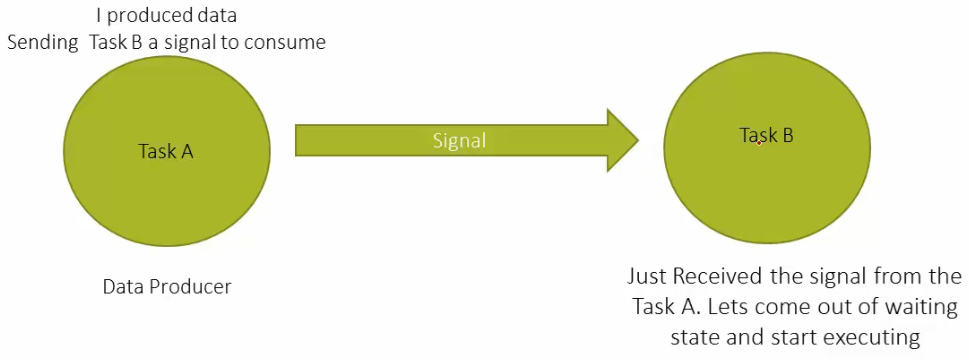
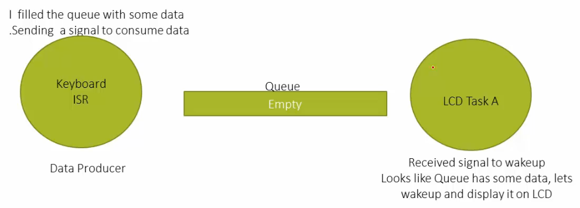

<a href="../../">Home</a> > <a href="../notebook">Notebook</a> > <a href="./">Real-Time Operating Systems (RTOS)</a> > Overview of FreeRTOS Synchronization and Mutual Exclusion Services

# Overview of FreeRTOS Synchronization and Mutual Exclusion Services


## Synchronization Between Tasks

* Both the Task A and Task B operate based on the signaling rule they have agreed upon.

  Task A knows when to signal Task B and Task B knows what to do when it receives the signal.





## Synchronization Between Task and Interrupt

* Both the Keyboard ISR and LCD Task A operate based on the signaling rule they have agreed upon.

  Keyboard ISR knows when to signal LCD Task B and LCD Task B knows what to do when it receives the signal.

* When the Queue has some data in it, the producer will signal the consumer to consume the data.





## How to Achieve This Signaling?

* Following software subsystems support signaling hence an be used in synchronization:

  * Events (or Event Flags)
  * **Semaphores (Counting and binary)**
  * **Queues** and Message Queues
  * Pipes
  * Mailboxes
  * Signals (UNIX like signals)
  * **Mutex**

  FreeRTOS supports Semaphores, Queues, and Mutexes to achieve synchronization.


## Mutual Exclusion Services of FreeRTOS

* Mutual exclusion

  * Means allowing only one thread access the shared resource at any point in time. 

  * This avoids the **race condition** between threads acquiring the resource.

  * In general, achieved by locking the resource before using it and unlocking after finished using it.

  * Example

    ```c
    #include <pthread.h>
    
    int counter = 0;
    pthread_mutex_t mutex = PTHREAD_MUTEX_INITIALIZER;
    
    void func(void *arg)
    {
        int val;
        pthread_mutex_lock(&mutex);		// entering critical section
        val = counter;
        counter = val + 1;
        pthread_mutex-unlock(&mutex); 	// leaving critical section
        
        return NULL;
    }
    ```

    > L6 - Suppose this is a shared function between multiple tasks in an application. This function must be thread safe.

* Synchronization
  * Means synchronizing the order in which multiple threads access a shared resource.


## References

Nayak, K. (2022). *Mastering RTOS: Hands on FreeRTOS and STM32Fx with Debugging* [Video file]. Retrieved from https://www.udemy.com/course/mastering-rtos-hands-on-with-freertos-arduino-and-stm32fx/

