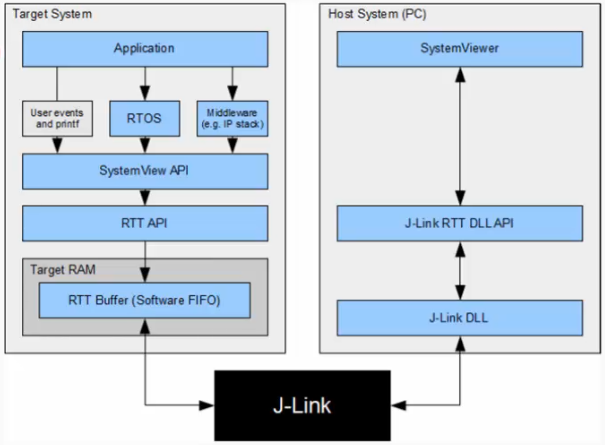
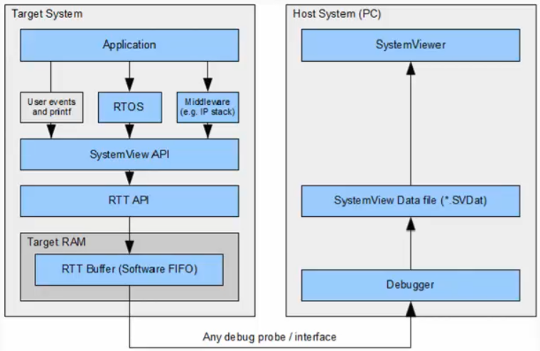

<a href="../">Notebook</a> > <a href="./">Real-Time Operating Systems (RTOS)</a> > SEGGER SystemView UART-Based Recording

# SEGGER SystemView UART-Based Recording

### SystemView Visualization Modes

1. **Real-time recording (Continuous recording)**

   With a SEGGER J-Link and its Real-Time Transfer (RTT) technology SystemView can continuously record data and transfer them to the host so that we can analyze and visualize them in real-time.

   Real-time mode can be achieved via ST-Link instead of J-Link. To do that J-Link firmware has to be flashed on ST-Link circuitry of STM32 boards. More on this later.

   Application (`main.c`), RTOS (FreeRTOS), we need to include SystemView API and RTT API, RTT Buffer is an array that the events to be transferred get stored.

   

   

   

2. **Single-shot recording**

   No J-Link or ST-Link debugger is required. When no J-Link is used, SEGGER SystemView can be used to record data until its target buffer is filled.

   In Single-shot mode the recording is started manually in the application, which allows recording only specific parts of our interest. The events will fill up the RTT Buffer in RAM, and at some point we can stop recording and dump the contents of the buffer to a file (.SVDat) to analyze them on the host PC.

   

   

   

## References

Nayak, K. (2022). *Mastering RTOS: Hands on FreeRTOS and STM32Fx with Debugging* [Video file]. Retrieved from https://www.udemy.com/course/mastering-rtos-hands-on-with-freertos-arduino-and-stm32fx/
