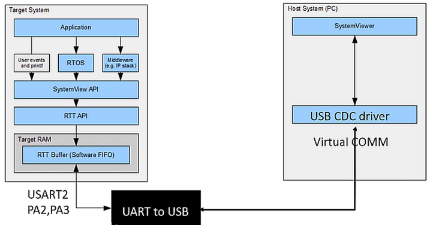
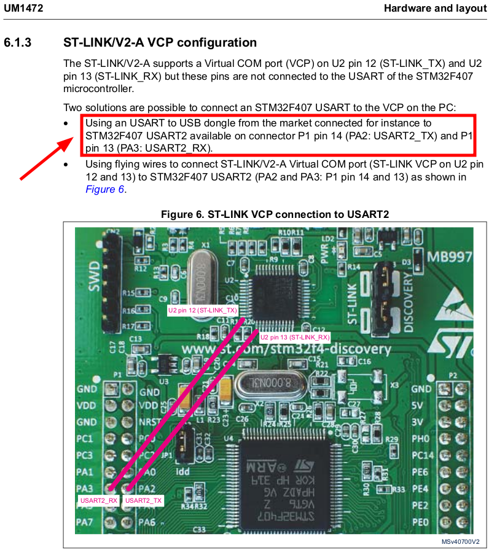
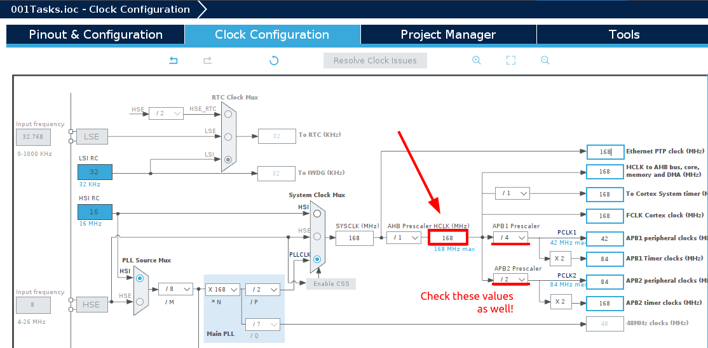
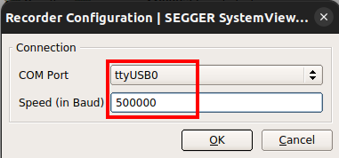

<a href="../../">Home</a> > <a href="../notebook">Notebook</a> > <a href="./">Real-Time Operating Systems (RTOS)</a> > SEGGER SystemView UART-Based Recording

# SEGGER SystemView UART-Based Recording


## Real-Time Recording (Continuous Recording)

* SEGGER SystemView supports continuous recording in three ways:

  * **Using J-Link based debug probe**

    

    

    

    * Need J-Link based debug probe

    * ST-Link (on-board) debug probe can also be used (ST-Link firmware must first be converted to J-Link firmware by using the ST-Link reflash utility provided by SEGGER) 

      However, this method has some drawbacks. Once the ST-Link is converted to J-Link firmware, we will no longer be able to debug the application using STM32 CubeIDE. So, we won't be using this method.

  * **Using IP based communication**

  * **Using UART communication**

    

    

    

    * We will be using this method since it gives us the ability to do the real-time recording as well as the application debugging using STM32 CubeIDE.


## SEGGER SystemView UART-Based Recording

* Setup a UART-to-USB port since the host machine does not support UART communication.

* Setting up the Virtual COM port (VCP) communication:

  ST-LINK/V2-A (ST-LINK circuitry on STM32F407x DISCOVERY board) supports an on-board Virtual COM port on U2 pin 12 (ST-LINK_TX) and U2 pin 13 (ST-LINK_RX) but these pins are NOT connected to the USART of the STM32F407 microcontroller. This is the problem! (c.f., F446RE NUCLEO board supports on-board Virtual COM port.)

  So, we need an external USB-to-UART converter module. Any **USB-to-TTL Serial Converter Adapter** will do.

  Install the driver ([https://ftdichip.com/drivers](https://ftdichip.com/drivers))

  | USB-UART module pins | STM32F407x DISC board pins |
  | -------------------- | -------------------------- |
  | TX                   | RX (PA3)                   |
  | RX                   | TX (PA2)                   |
  | GND                  | GND                        |





* Connect the board according to the pin table mentioned above, and check the Virtual COM port the serial device is connected to by using `dmesg` command or `watch tail /var/log/syslog`. 
  * In my environment $\to$ ttyUSB0

* Create a `Project/ThirdParty/Rec/` folder, and import `segger_uart.c` file into the folder. This is the file is used to enable the UART-based real-time recording.

* In `SEGGER_SYSVIEW_Conf.h` file, add the following code:

  ```c
  /* SEGGER_SYSVIEW_Conf.h */
  /*********************************************************************
  * TODO: Add your defines here.                                       *
  **********************************************************************
  */
  
  #define SEGGER_UART_REC 1
  
  #if (SEGGER_UART_REC == 1)
  	extern void HIF_UART_EnableTXEInterrupt  (void);
  	#define SEGGER_SYSVIEW_ON_EVENT_RECORDED(x)  HIF_UART_EnableTXEInterrupt()
  #endif
  ```

  > L7: Enabling UART-based real-time recording.

* In `main.c`, insert `SEGGER_UART_init(500000);` before calling `SEGGER_SYSVIEW_Conf();`. (Also, function prototype `extern void SEGGER_UART_init(uint32_t);`)

  To achieve the baud rate of 500000, you need to go to the "Device Configuration Tool" $\to$ Clock Configuration, and set the `HCLK(MHz)` to its maximum value, 168.
  
  [!] Note: Configuring clock and baud rate requires some calculations. Consult the MCU Reference Manual $\to$ USART functional description $\to$ Fractional baud rate generation





* In `main.c`, comment out `SEGGER_SYSVIEW_Start();` since now we want to call this function from `Project/ThirdParty/Rec/segger_uart.c`.
  * Don't forget this step! If you do not comment this out, you will see nothing on the SystemView window when you start recording.
* Check if `#define configUSE_PREEMPTION 0` (cooperative scheduling), build the project and flash it to target.
* Open SystemView $\to$ Target $\to$ Recorder Configuration $\to$ UART





* Start recording!


## References

Nayak, K. (2022). *Mastering RTOS: Hands on FreeRTOS and STM32Fx with Debugging* [Video file]. Retrieved from https://www.udemy.com/course/mastering-rtos-hands-on-with-freertos-arduino-and-stm32fx/
