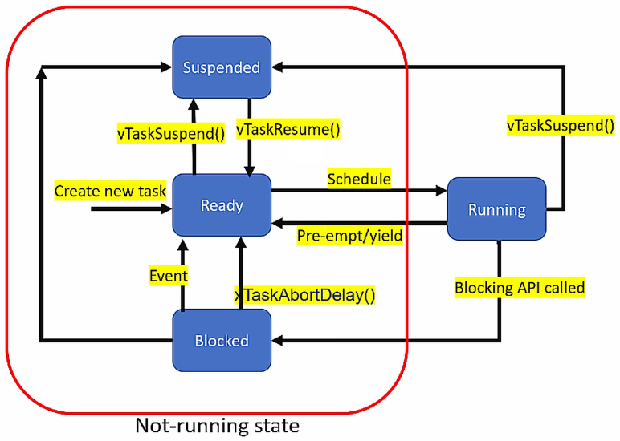

<a href="../">Notebook</a> > <a href="./">Real-Time Operating Systems (RTOS)</a> > Task States

# Task States

## FreeRTOS Task States

### Blocked

* A task can leave a CPU from the Running state and chooses not to run on the CPU until an internal or external event is met. This state is the **Blocked** state.
* When a task is in the Blocked state, it won't consume any CPU time.
* In FreeRTOS, there is an API called `vTaskDelay()`. If a task calls this function, then it will enter the Blocked state for the passed number of RTOS ticks (500 RTOS ticks if `vTaskDelay(500)`), after which it unblocks and enters the Ready state (an internal temporal event).
* A task can also block waiting on an external event, like data arrival to the queue, nonavailability of lock in the case of mutex or semaphore, etc.
* Task in a Blocked state has a timeout period; after the timeout period, it unblocks and enters the Ready state even if the event for which it is waiting has not occurred. 
* A task can enter the Blocked state ONLY from the Running state.

## References

Nayak, K. (2022). *Mastering RTOS: Hands on FreeRTOS and STM32Fx with Debugging* [Video file]. Retrieved from https://www.udemy.com/course/mastering-rtos-hands-on-with-freertos-arduino-and-stm32fx/

